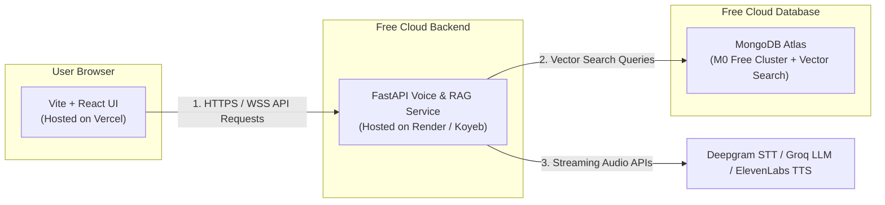

# ?? Free-Tier Production Deployment Guide

This guide provides step-by-step instructions to deploy the **Real-Time Voice AI Agent & RAG System** using 100% **FREE** hosting platforms (**Vercel**, **Render**, **Koyeb**, and **MongoDB Atlas**).

---

## ??? Architecture Overview



---

## ? Step 1: Database Setup (MongoDB Atlas Free M0)

1. Sign up / log in to [MongoDB Atlas](https://www.mongodb.com/cloud/atlas).
2. Create a **FREE M0 Shared Cluster** (Select AWS us-east-1 or closest region).
3. **Database Access**: Create a Database User with read/write permissions (e.g. `voice_user` + password).
4. **Network Access**: Add IP Access List entry `0.0.0.0/0` (Allows access from Vercel & Render).
5. **Connection String**: Copy your connection string:
   ```text
   mongodb+srv://voice_user:<password>@cluster0.mongodb.net/?retryWrites=true&w=majority
   ```
6. **Create Vector Search Index**:
   * Navigate to database `voice_agent` $\rightarrow$ collection `document_chunks`.
   * Create Vector Search Index named `vector_index` with definition:
     ```json
     {
       "fields": [
         {
           "numDimensions": 768,
           "path": "embedding",
           "similarity": "cosine",
           "type": "vector"
         },
         {
           "path": "tenant_id",
           "type": "filter"
         },
         {
           "path": "equipment_id",
           "type": "filter"
         }
       ]
     }
     ```

---

## ?? Step 2: Backend Deployment (Render or Koyeb Free Tier)

### Option A: Render (Free Web Service)

1. Sign up / log in to [Render.com](https://render.com/).
2. Click **New +** $\rightarrow$ **Web Service**.
3. Connect your GitHub repository `Shivanshvyas1729/Real-Time-Voice-AI-Agent-with-RAG`.
4. Configure settings:
   * **Name**: `voice-agent-backend`
   * **Region**: Oregon (US West) or Frankfurt (EU)
   * **Root Directory**: `backend`
   * **Runtime**: `Python 3` (or `Docker`)
   * **Build Command**: `pip install -r requirements.txt`
   * **Start Command**: `uvicorn main:app --host 0.0.0.0 --port $PORT`
   * **Instance Type**: **Free**
5. Add **Environment Variables**:
   * `MONGO_URL` = `mongodb+srv://voice_user:<password>@cluster0.mongodb.net/...`
   * `DB_NAME` = `voice_agent`
   * `DEEPGRAM_API_KEY` = `your_deepgram_key`
   * `GROQ_API_KEY` = `your_groq_key`
   * `AICREDITS_API_KEY` = `your_aicredits_key`
   * `ELEVENLABS_API_KEY` = `your_elevenlabs_key`
6. Click **Create Web Service**. Render will deploy your backend and provide a public URL (e.g. `https://voice-agent-backend.onrender.com`).

---

### Option B: Koyeb (Free Docker Deployment)

1. Sign up / log in to [Koyeb.com](https://www.koyeb.com/).
2. Click **Create App** $\rightarrow$ Select **GitHub**.
3. Choose repository `Shivanshvyas1729/Real-Time-Voice-AI-Agent-with-RAG`.
4. Set **Workdir**: `backend`
5. Select **Builder**: `Dockerfile` (Koyeb automatically uses `backend/Dockerfile`).
6. Add Environment Variables (same as Render).
7. Deploy. Koyeb provides a native WebSocket-capable free URL (e.g. `https://voice-agent-backend.koyeb.app`).

---

## ?? Step 3: Frontend Deployment (Vercel Free Tier)

1. Sign up / log in to [Vercel](https://vercel.com/).
2. Click **Add New...** $\rightarrow$ **Project**.
3. Import your GitHub repository `Shivanshvyas1729/Real-Time-Voice-AI-Agent-with-RAG`.
4. In Project Settings:
   * **Framework Preset**: `Vite`
   * **Root Directory**: Click Edit $\rightarrow$ Select `frontend`.
5. Expand **Environment Variables**:
   * Add `VITE_API_BASE_URL` = `https://voice-agent-backend.onrender.com` (replace with your actual Render/Koyeb backend URL).
6. Click **Deploy**.
7. Vercel will build and launch your application frontend at a free HTTPS URL (e.g. `https://real-time-voice-ai-agent.vercel.app`).

---

## ? Step 4: Verification & Testing

1. Open your Vercel URL in Chrome or Edge (`https://your-app.vercel.app`).
2. Upload equipment documentation (PDF/Docx) to test ingestion and vector index embedding creation.
3. Start a Real-Time Voice session to test full-duplex WebSockets, STT transcription, LLM RAG response generation, and TTS audio playback.

---

## ?? Summary of Free Resources Used

| Component | Host / Provider | Free Tier Allowance |
| :--- | :--- | :--- |
| **Frontend** | Vercel | Unlimited static sites, global CDN, HTTPS |
| **Backend** | Render / Koyeb | 512MB RAM free web service, WebSockets support |
| **Database & Vector Search** | MongoDB Atlas | 512MB free M0 cluster + Atlas Vector Search |
| **Speech-to-Text** | Deepgram | $200 free credit |
| **LLM Inference** | Groq | 30 requests/min free tier (Llama 3) |
| **Text-to-Speech** | ElevenLabs | 10,000 characters/month free |

