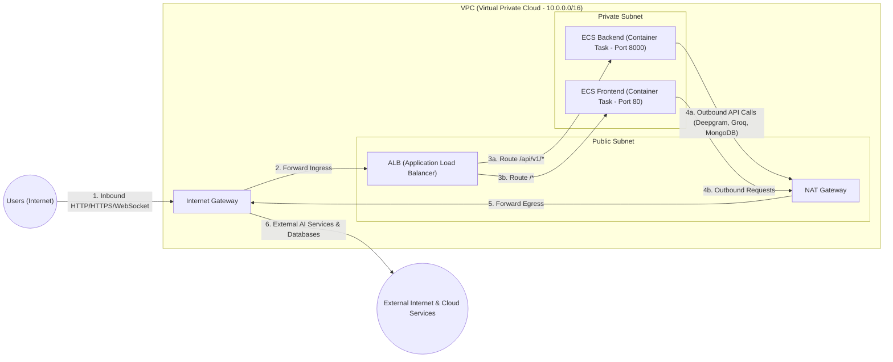
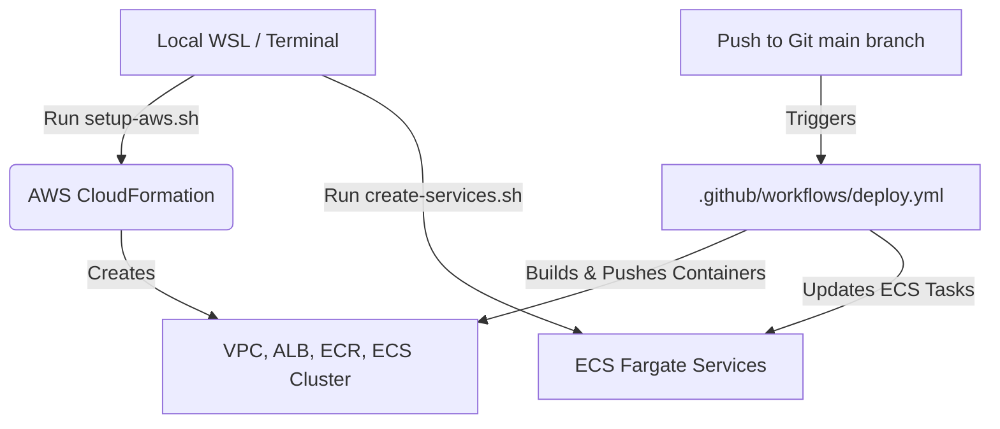

# ??? AWS VPC Cloud Architecture & Flow Breakdown

This document provides a component-by-component technical explanation and visual traffic flow diagram for the AWS production deployment architecture of the **Real-Time Voice AI Agent & RAG System**.

---

## ?? System Architecture Diagram



---

## ?? Component-by-Component Explanation

### 1. ?? Users (Internet)
* **Role**: Public clients (web browsers, mobile devices, external webhooks) accessing the Voice AI platform.
* **Function**: Initiates HTTP requests for frontend pages, REST API calls for RAG/document operations, and persistent bi-directional WebSockets for real-time voice streaming.

### 2. ?? Internet Gateway (IGW)
* **Role**: The edge entry/exit gateway for the AWS Virtual Private Cloud (VPC).
* **Function**:
  * Provides a target in VPC route tables for internet-routable traffic.
  * Performs Network Address Translation (NAT) for public IP addresses.
  * Allows public clients on the internet to reach public-facing AWS resources (ALB) and allows internal resources (via NAT Gateway) to access external web services.

### 3. ??? VPC (Virtual Private Cloud)
* **Role**: The logically isolated virtual network boundary in the AWS Cloud (`10.0.0.0/16`).
* **Function**: Enforces strict network isolation, IP address range allocation, routing tables, and security group firewalls for all application components.

### 4. ?? Public Subnet
* **Role**: A VPC subnet configured with a route table entry pointing directly to the Internet Gateway.
* **Function**: Hosts public-facing components that require direct internet exposure or public IP allocation.
* **Key Components**:
  * **ALB (Application Load Balancer)**:
    * Acts as the single entry point for all incoming web and WebSocket connections.
    * Performs SSL/TLS termination.
    * Evaluates Layer 7 path rules: routes `/api/v1/*` requests to the Backend target group and all remaining paths `/*` to the Frontend target group.
    * Health-checks private ECS tasks to guarantee zero-downtime routing.
  * **NAT Gateway (Network Address Translation)**:
    * Managed network device allocated with a Elastic IP (EIP) inside the public subnet.
    * Allows private instances to initiate outbound connections while blocking unrequested inbound connections from the internet.

### 5. ?? Private Subnet
* **Role**: An isolated VPC subnet with no route to the Internet Gateway and no public IP addresses assigned.
* **Function**: Houses core compute workloads, keeping containerized application servers hidden and secured from direct internet access.
* **Key Components**:
  * **ECS Backend (Fargate Task Container)**:
    * Runs the Python FastAPI Real-Time Voice Agent application on port 8000.
    * Executes vector search algorithms, RAG pipeline orchestration, STT/TTS handling, and database interactions.
    * Accessible **only** via the ALB; outbound requests pass through the NAT Gateway.
  * **ECS Frontend (Fargate Task Container)**:
    * Runs the Nginx/Web frontend application container on port 80.
    * Serves static UI assets and manages frontend state.
    * Accessible **only** via the ALB; outbound requests pass through the NAT Gateway.

---

## ?? End-to-End Traffic Flow

### ?? Inbound Traffic Flow (Request Ingress)
1. **User Request**: A client sends an HTTP request or opens a WebSocket connection to the domain name.
2. **Internet Gateway**: The packet arrives at AWS and passes through the VPC **Internet Gateway**.
3. **Application Load Balancer**: Traffic reaches the **ALB** located in the **Public Subnet**.
4. **Target Routing**: The **ALB** evaluates URL path rules and forwards traffic across the subnet boundary into the **Private Subnet**:
   * API/Voice WebSocket requests $\rightarrow$ **ECS Backend** (Port 8000).
   * Web page requests $\rightarrow$ **ECS Frontend** (Port 80).

### ?? Outbound Traffic Flow (Request Egress)
1. **Outbound Trigger**: **ECS Backend** needs to connect to external cloud services (e.g. MongoDB Atlas Vector Search, Deepgram STT, Groq LLM, ElevenLabs TTS).
2. **Private Route Table**: Private Subnet route table directs all `0.0.0.0/0` outbound traffic to the **NAT Gateway**.
3. **NAT Processing**: The **NAT Gateway** in the **Public Subnet** translates the source private IP to its public Elastic IP (EIP).
4. **Internet Gateway Egress**: Packet is forwarded through the **Internet Gateway** out to the public internet.
5. **Response Handling**: Returning packets flow back through the **NAT Gateway**, which translates the destination IP back to the private IP of the initiating ECS container task.

---

## ?? Summary Matrix

| Component | Subnet Type | Public IP? | Primary Purpose |
| :--- | :--- | :--- | :--- |
| **Internet Gateway** | VPC Edge | Yes | Gateway for VPC inbound & outbound traffic |
| **ALB (Load Balancer)** | Public Subnet | Yes | Public entry point, SSL termination, L7 routing |
| **NAT Gateway** | Public Subnet | Yes (EIP) | Outbound internet access for private workloads |
| **ECS Backend** | Private Subnet | No | Voice AI & RAG pipeline logic execution (Port 8000) |
| **ECS Frontend** | Private Subnet | No | Web UI static asset & frontend delivery (Port 80) |


# 🚀 Production Deployment Guide

This guide details how to deploy the **Real-Time Voice AI Agent with RAG** application to AWS using **ECS Fargate**, **Application Load Balancer (ALB)**, **Secrets Manager**, and **CloudFormation**.

Developer: **Shivansh Vyas** (Shivanshvyas1729)

---

## 📌 Architecture Diagrams

### 1. AWS Cloud Infrastructure Architecture

```mermaid
graph TB
    subgraph AWSCloud["AWS Cloud (Region: us-east-1)"]
        subgraph VPC["VPC (10.0.0.0/16)"]
            IGW[Internet Gateway]
            
            subgraph PublicSubnets["Public Subnets (Subnet 1 & 2)"]
                ALB[Application Load Balancer]
                NAT[NAT Gateway]
            end
            
            subgraph PrivateSubnets["Private Subnets (Subnet 1 & 2)"]
                subgraph ECSCluster["ECS Cluster (rag-voice-agent-cluster)"]
                    BackendTask[ECS Task: Backend Container - Port 8000]
                    FrontendTask[ECS Task: Frontend Container - Port 80]
                end
            end
        end
        
        Secrets[AWS Secrets Manager: rag-voice-agent-secrets]
        ECR_BE[ECR Repository: rag-voice-agent-backend]
        ECR_FE[ECR Repository: rag-voice-agent-frontend]
    end

    Users([Internet Users]) -->|HTTP/HTTPS Traffic| ALB
    ALB -->|Routes /api/v1/*| BackendTask
    ALB -->|Routes /*| FrontendTask
    BackendTask -->|Retrieves Secrets| Secrets
    ECS Cluster -->|Pulls Docker Images| ECR_BE
    ECS Cluster -->|Pulls Docker Images| ECR_FE
    BackendTask -->|Outbound Internet Access| NAT
    NAT --> IGW
```

---

### 2. End-to-End Deployment Workflow



---

## 🛠️ Step-by-Step Production Deployment

### Phase 1: Infrastructure & Secrets Setup

1. **Navigate to the infrastructure directory:**
   ```bash
   cd /home/dell/voice-agent/infrastructure
   chmod +x setup-aws.sh destroy-aws.sh
   `

2. **Run the AWS setup script:**
   ```bash
   ./setup-aws.sh
   `

3. **Provide API Keys when prompted:**
   - **MongoDB URL:** mongodb+srv://...
   - **Deepgram API Key:** ...
   - **Groq API Key:** ...
   - **AICredits API Key:** sk-live-... *(For BAAI/BGE-M3 Embeddings)*
   - **ElevenLabs API Key:** ...

> 📌 **Output:** Note down the **ALB DNS Name** (e.g. http://rag-voice-agent-alb-2081652027.us-east-1.elb.amazonaws.com) and ECR Repository URLs.

---

### Phase 2: Build & Push Docker Containers

Build backend and frontend Docker containers for linux/amd64 and push to AWS ECR:

```bash
cd /home/dell/voice-agent/scripts
chmod +x build-and-push-ecr.sh create-services.sh deploy_aws.sh
./build-and-push-ecr.sh
```

---

### Phase 3: Register Task Definitions & Create ECS Services

Register Task Definitions and create active Fargate services attached to your Load Balancer:

```bash
# Register Task Definitions
aws ecs register-task-definition --cli-input-json file://../.github/workflows/task-definition-backend.json --region us-east-1
aws ecs register-task-definition --cli-input-json file://../.github/workflows/task-definition-frontend.json --region us-east-1

# Create Services
./create-services.sh
```

---

### Phase 4: Configure GitHub Actions CI/CD Pipeline

To enable automated zero-downtime deployment when pushing to GitHub:

1. Open your GitHub Repository: **Settings ➔ Secrets and variables ➔ Actions**.
2. Add the following repository secrets:

| Secret Name | Value Description |
| :--- | :--- |
| **AWS_ACCESS_KEY_ID** | Your AWS Access Key ID |
| **AWS_SECRET_ACCESS_KEY** | Your AWS Secret Access Key |
| **AWS_REGION** | us-east-1 |

---

### Phase 5: Resource Teardown (Prevent Unwanted Billing)

To avoid hourly AWS charges when you stop working:

```bash
cd /home/dell/voice-agent/infrastructure
./destroy-aws.sh
```

---

## 🔍 Troubleshooting

- **Missing ECS Service-Linked Role Error:**
  ```bash
  aws iam create-service-linked-role --aws-service-name ecs.amazonaws.com
  `
- **Browser Microphone Permission Error on ALB URL:**
  In Chrome/Edge flags (chrome://flags/#unsafely-treat-insecure-origin-as-secure), add your ALB URL as an allowed secure origin.
- **Terminal Pager (:) Prompt:**
  Press q on your keyboard to exit the less pager.
