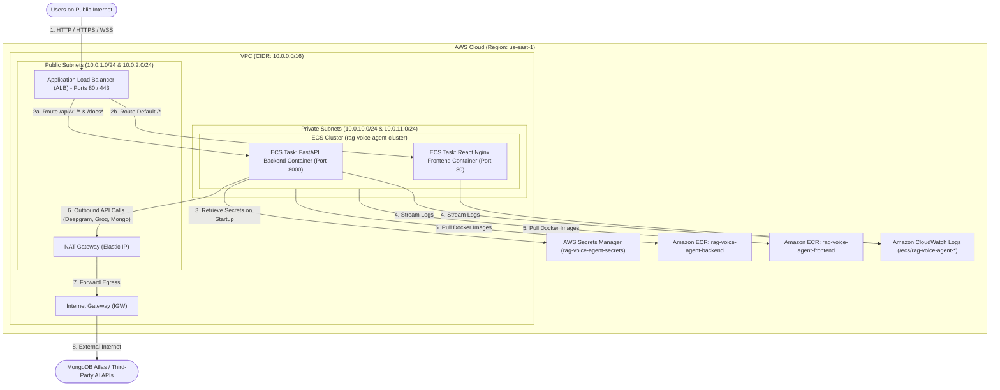

# AWS Cloud VPC Architecture & Infrastructure Deployment Guide
## Complete Technical Breakdown, Code Specifications & Step-by-Step Build Tutorial
**Developer**: Shivansh Vyas (`Shivanshvyas1729`)  
**Project**: Industrial Real-Time Voice AI Agent & RAG System  
**Infrastructure Stack**: AWS CloudFormation (IaC), VPC, ALB, ECS Fargate, ECR, Secrets Manager, CloudWatch, GitHub Actions CI/CD  

---

# Table of Contents
1. [VPC Architecture & Network Flow Overview](#1-vpc-architecture--network-flow-overview)
   - [1.1 Network Architecture Diagram](#11-network-architecture-diagram)
   - [1.2 Core Component Breakdown](#12-core-component-breakdown)
   - [1.3 Inbound & Outbound Traffic Packet Flow](#13-inbound--outbound-traffic-packet-flow)
2. [Foundational AWS Concepts (Beginner to Pro Guide)](#2-foundational-aws-concepts-beginner-to-pro-guide)
   - [2.1 What is AWS CloudFormation (Infrastructure-as-Code)?](#21-what-is-aws-cloudformation-infrastructure-as-code)
   - [2.2 What is Amazon ECR (Elastic Container Registry)?](#22-what-is-amazon-ecr-elastic-container-registry)
   - [2.3 What is Amazon ECS Fargate (Serverless Compute)?](#23-what-is-amazon-ecs-fargate-serverless-compute)
   - [2.4 What is AWS Secrets Manager & IAM Role Delegation?](#24-what-is-aws-secrets-manager--iam-role-delegation)
3. [AWS Code File Explanations & Line-by-Line Specifications](#3-aws-code-file-explanations--line-by-line-specifications)
   - [3.1 `infrastructure/cloudformation.yaml` Breakdown](#31-infrastructurecloudformationyaml-breakdown)
   - [3.2 `infrastructure/setup-aws.sh` Breakdown](#32-infrastructuresetup-awssh-breakdown)
   - [3.3 `infrastructure/destroy-aws.sh` Breakdown](#33-infrastructuredestroy-awssh-breakdown)
   - [3.4 `scripts/build-and-push-ecr.sh` Breakdown](#34-scriptsbuild-and-push-ecrsh-breakdown)
   - [3.5 `scripts/create-services.sh` Breakdown](#35-scriptscreate-servicessh-breakdown)
   - [3.6 `scripts/deploy_aws.sh` Breakdown](#36-scriptsdeploy_awssh-breakdown)
   - [3.7 `.github/workflows/deploy.yml` CI/CD Workflow Breakdown](#37-githubworkflowsdeployyml-cicd-workflow-breakdown)
   - [3.8 ECS Task Definition JSON Files Breakdown](#38-ecs-task-definition-json-files-breakdown)
4. [Step-by-Step Tutorial: How to Build & Deploy AWS Infrastructure from Scratch](#4-step-by-step-tutorial-how-to-build--deploy-aws-infrastructure-from-scratch)
   - [Step 0: Prerequisites & AWS CLI Authentication](#step-0-prerequisites--aws-cli-authentication)
   - [Step 1: Create AWS Secrets Manager Secret](#step-1-create-aws-secrets-manager-secret)
   - [Step 2: Deploy CloudFormation IaC Stack (`setup-aws.sh`)](#step-2-deploy-cloudformation-iac-stack-setup-awssh)
   - [Step 3: Build & Push Container Images to ECR (`build-and-push-ecr.sh`)](#step-3-build--push-container-images-to-ecr-build-and-push-ecrsh)
   - [Step 4: Register ECS Task Definitions & Launch Services (`create-services.sh`)](#step-4-register-ecs-task-definitions--launch-services-create-servicessh)
   - [Step 5: Test Application & Monitor Logs via CloudWatch](#step-5-test-application--monitor-logs-via-cloudwatch)
   - [Step 6: Configure GitHub Actions CI/CD for Zero-Downtime Deploys](#step-6-configure-github-actions-cicd-for-zero-downtime-deploys)
   - [Step 7: Complete Environment Tear-Down & Cleanup (`destroy-aws.sh`)](#step-7-complete-environment-tear-down--cleanup-destroy-awssh)
5. [Interview Defense Guide: How to Explain AWS Architecture Confidently](#5-interview-defense-guide-how-to-explain-aws-architecture-confidently)

---

# 1. VPC Architecture & Network Flow Overview

## 1.1 Network Architecture Diagram



---

## 1.2 Core Component Breakdown

1. **Virtual Private Cloud (VPC)**: Custom isolated virtual network spanning CIDR block `10.0.0.0/16` (65,536 private IP addresses). Provides complete network isolation from other AWS customers.
2. **Internet Gateway (IGW)**: The VPC's edge router attached to the public internet, translating internal VPC requests into internet-routable packets.
3. **Public Subnets (`10.0.1.0/24` & `10.0.2.0/24`)**: Subnets configured with a route table entry sending `0.0.0.0/0` directly to the IGW. Houses public-facing resources (**ALB** and **NAT Gateway**).
4. **Private Subnets (`10.0.10.0/24` & `10.0.11.0/24`)**: Subnets with **NO direct route to IGW** and no public IP assignments. Houses compute workloads (**ECS Fargate Container Tasks**), shielding backend servers from internet scanning attacks.
5. **Application Load Balancer (ALB)**: Internet-facing load balancer sitting in public subnets across 2 Availability Zones. Performs SSL/TLS termination, routes traffic based on URL path patterns (`/api/*` $\rightarrow$ Backend TG, `/*` $\rightarrow$ Frontend TG), and executes health checks.
6. **NAT Gateway**: Network Address Translation device in the public subnet with an assigned Elastic IP (EIP). Allows private ECS container tasks to initiate outbound outbound network connections (to MongoDB Atlas, Deepgram, Groq) while blocking unsolicited inbound connections from the internet.
7. **Amazon ECR**: Managed Docker container image registries storing versioned application container images.
8. **Amazon ECS Fargate**: Serverless container orchestration engine running container tasks without requiring management of EC2 virtual machine instances.
9. **AWS Secrets Manager**: Encrypted secrets store housing sensitive database connection strings (`MONGO_URL`) and AI service API keys (`DEEPGRAM_API_KEY`, `GROQ_API_KEY`, `ELEVENLABS_API_KEY`).

---

## 1.3 Inbound & Outbound Traffic Packet Flow

### 📥 Inbound Traffic Flow (Client Request Ingress):
1. **Client Connection**: User browser opens `https://yourdomain.com/api/v1/stream/connect`.
2. **Internet Gateway**: Packet enters VPC via the **IGW**.
3. **ALB Processing**: Traffic lands on the **ALB** in the public subnets. ALB terminates TLS/SSL, inspects the HTTP path `/api/v1/stream/connect`, and matches `ALBListenerRuleAPI`.
4. **Private Forwarding**: ALB routes the request to an active private IP in the `BackendTargetGroup` (port 8000) inside the **Private Subnet**.
5. **FastAPI Processing**: Backend processes request and returns response back through ALB to the client.

### 📤 Outbound Traffic Flow (Backend Egress to AI APIs & MongoDB):
1. **Outbound Call Trigger**: Backend container in the **Private Subnet** needs to make a WebSocket connection to Deepgram (`wss://api.deepgram.com`) or query MongoDB Atlas.
2. **Private Route Table**: Private subnet route table routes all `0.0.0.0/0` outbound packets to the **NAT Gateway** in the public subnet.
3. **NAT Translation**: NAT Gateway replaces the container's private IP (`10.0.10.x`) with its public Elastic IP (EIP).
4. **IGW Egress**: Packet leaves the VPC via the **IGW** to third-party cloud APIs.
5. **Response Return**: Returning packets flow back into NAT Gateway, which translates destination IP back to container's private IP (`10.0.10.x`).

---

# 2. Foundational AWS Concepts (Beginner to Pro Guide)

If you have never built AWS infrastructure before, this section explains the foundational concepts in simple terms.

## 2.1 What is AWS CloudFormation (Infrastructure-as-Code)?
Instead of clicking around the AWS Web Console manually to create VPCs, subnets, and load balancers (which is error-prone and non-reproducible), **CloudFormation** allows you to write your entire cloud infrastructure as code in a single YAML file (`cloudformation.yaml`).
* You run one command (`aws cloudformation create-stack`), and AWS automatically provisions all 20+ resources in the exact right order.
* If you want to delete everything, you run `aws cloudformation delete-stack`, and AWS safely destroys all resources without leaving orphaned billing items.

## 2.2 What is Amazon ECR (Elastic Container Registry)?
Amazon ECR is AWS's private Docker hub.
* When you package your application into a Docker container image on your machine (`docker build`), you push it to ECR (`docker push`).
* ECR scans your Docker images for security vulnerabilities and provides a secure URL (e.g. `117591992815.dkr.ecr.us-east-1.amazonaws.com/rag-voice-agent-backend:latest`) that ECS uses to download and run your app.

## 2.3 What is Amazon ECS Fargate (Serverless Compute)?
Traditionally, running Docker containers required renting virtual machines (AWS EC2 instances), configuring Linux OS updates, and managing server clusters.
**ECS Fargate** is serverless: you tell AWS, *"Run my Docker container image with 0.5 vCPU and 1GB RAM,"* and AWS provisions compute instantly without you managing any underlying Linux operating systems or servers.

## 2.4 What is AWS Secrets Manager & IAM Role Delegation?
Hardcoding API keys inside Docker containers or GitHub repositories is a major security vulnerability.
* **AWS Secrets Manager** securely stores encrypted key-value pairs (like `MONGO_URL` or `GROQ_API_KEY`).
* **IAM Roles**: When ECS Fargate boots your backend container, AWS attaches an **ECS Execution Role**. This role grants the container permission to fetch secrets from Secrets Manager at boot time and inject them directly into Python's environment variables (`os.environ`).

---

# 3. AWS Code File Explanations & Line-by-Line Specifications

---

## 3.1 `infrastructure/cloudformation.yaml` Breakdown

This file is the master **Infrastructure-as-Code (IaC)** blueprint. It defines 22 AWS cloud resources.

### Key Sections:

#### 1. Parameters (Lines 1-40)
Defines customizable configuration variables with sensible defaults:
- `VpcCIDR`: `10.0.0.0/16`
- `PublicSubnet1CIDR`: `10.0.1.0/24`, `PublicSubnet2CIDR`: `10.0.2.0/24`
- `PrivateSubnet1CIDR`: `10.0.10.0/24`, `PrivateSubnet2CIDR`: `10.0.11.0/24`
- `BackendPort`: `8000`, `FrontendPort`: `80`

#### 2. Network Infrastructure (VPC & Subnets)
- `VPC`: Creates `AWS::EC2::VPC` with DNS hostnames enabled.
- `InternetGateway` & `VPCGatewayAttachment`: Attaches IGW to VPC.
- `PublicSubnet1` & `PublicSubnet2`: Created across Availability Zones `us-east-1a` and `us-east-1b` with `MapPublicIpOnLaunch: true`.
- `PrivateSubnet1` & `PrivateSubnet2`: Created across AZs `us-east-1a` and `us-east-1b` with `MapPublicIpOnLaunch: false`.

#### 3. Routing & NAT Gateway
- `NatGatewayEIP`: Allocates an Elastic IP address.
- `NatGateway`: Launches managed NAT Gateway in `PublicSubnet1`.
- `PublicRouteTable` & `PrivateRouteTable`: Configures route rules (`0.0.0.0/0` $\rightarrow$ IGW for Public, `0.0.0.0/0` $\rightarrow$ NAT for Private).

#### 4. Security Groups (Firewalls)
- `ALBSecurityGroup`: Allows inbound traffic on ports `80` (HTTP) and `443` (HTTPS) from any IP (`0.0.0.0/0`).
- `BackendSecurityGroupIngress`: Restricts backend access (port 8000) so it **ONLY accepts traffic originating from `ALBSecurityGroup`**. Direct internet access to port 8000 is blocked.
- `FrontendSecurityGroupIngress`: Restricts frontend access (port 80) so it **ONLY accepts traffic originating from `ALBSecurityGroup`**.

#### 5. Load Balancer & Target Groups
- `LoadBalancer`: Creates Internet-facing Application Load Balancer across both public subnets. Includes attribute `idle_timeout.timeout_seconds = 600` to prevent WebSocket connections from timing out during voice streams.
- `BackendTargetGroup`: Target group for FastAPI tasks on port 8000 using health check path `/health`.
- `FrontendTargetGroup`: Target group for Nginx tasks on port 80 using health check path `/`.
- `ALBListenerRuleAPI`: Priority 100 rule forwarding `/api/*` requests to `BackendTargetGroup`.
- `ALBListenerRuleDocs`: Priority 110 rule forwarding `/docs*`, `/openapi.json`, and `/health*` to `BackendTargetGroup`.
- `HTTPListener`: Priority default rule forwarding all remaining traffic (`/*`) to `FrontendTargetGroup`.

#### 6. ECR, ECS Cluster & IAM Roles
- `BackendRepository` & `FrontendRepository`: ECR image registries with `ScanOnPush: true`.
- `ECSCluster`: ECS Fargate cluster named `rag-voice-agent-cluster`.
- `ECSExecutionRole`: IAM role allowing ECS tasks to pull ECR images and send CloudWatch logs.
- `ECSSecretsPolicy`: Attached IAM policy permitting ECS Execution Role to fetch secrets from Secrets Manager.
- `ECSTaskRole`: IAM role assumed by container code during runtime.
- `BackendLogGroup` & `FrontendLogGroup`: CloudWatch log groups retained for 30 days.

#### 7. Outputs
Exports VPC IDs, Subnet IDs, ALB DNS Name, ECR URIs, IAM Role ARNs, and Target Group ARNs for use by setup scripts.

---

## 3.2 `infrastructure/setup-aws.sh` Breakdown

This Bash script automates initial CloudFormation stack deployment and AWS Secrets Manager setup.

```bash
#!/bin/bash
set -e # Exit immediately if any command fails

STACK_NAME="rag-voice-agent-stack"
REGION="us-east-1"
SECRET_NAME="rag-voice-agent-secrets"
```

### Execution Logic:
1. **Prerequisite Check**: Verifies AWS CLI is installed and configured (`aws sts get-caller-identity`).
2. **Secrets Manager Provisioning**: Checks if secret `rag-voice-agent-secrets` exists. If not, prompts user for `MONGO_URL`, `DEEPGRAM_API_KEY`, `GROQ_API_KEY`, `AICREDITS_API_KEY`, and `ELEVENLABS_API_KEY`, creating the secret via `aws secretsmanager create-secret`.
3. **CloudFormation Deployment**: Executes `aws cloudformation deploy --template-file cloudformation.yaml --stack-name rag-voice-agent-stack --capabilities CAPABILITY_NAMED_IAM`.
4. **Output Extraction**: Queries stack outputs via `aws cloudformation describe-stacks` to retrieve ALB DNS Name, ECR Repo URIs, Subnet IDs, and IAM Role ARNs.

---

## 3.3 `infrastructure/destroy-aws.sh` Breakdown

This safety script tears down all AWS cloud resources cleanly to prevent unexpected billing.

### Execution Logic:
1. **Safety Prompt**: Displays warning and asks user for explicit confirmation (`y/N`).
2. **ECS Service Scale-Down**: Discovers active ECS services, scales desired count to 0 (`aws ecs update-service --desired-count 0`), and deletes services (`aws ecs delete-service --force`).
3. **ECR Image Cleanup**: CloudFormation cannot delete non-empty ECR repositories. Script queries images via `aws ecr list-images` and deletes image batches using `aws ecr batch-delete-image`.
4. **CloudFormation Stack Deletion**: Runs `aws cloudformation delete-stack` and waits for complete removal using `aws cloudformation wait stack-delete-complete`.
5. **Optional Secret Removal**: Asks user if they want to permanently delete Secrets Manager secrets.

---

## 3.4 `scripts/build-and-push-ecr.sh` Breakdown

Automates Docker image compilation and ECR registry upload.

```bash
# 1. Authenticate Docker CLI against AWS ECR
aws ecr get-login-password --region us-east-1 | docker login --username AWS --password-stdin 117591992815.dkr.ecr.us-east-1.amazonaws.com

# 2. Build Docker images for linux/amd64 architecture (required for ECS Fargate)
docker build --platform linux/amd64 -t 117591992815.dkr.ecr.us-east-1.amazonaws.com/rag-voice-agent-backend:latest ./backend
docker build --platform linux/amd64 -t 117591992815.dkr.ecr.us-east-1.amazonaws.com/rag-voice-agent-frontend:latest ./frontend

# 3. Push images to ECR
docker push 117591992815.dkr.ecr.us-east-1.amazonaws.com/rag-voice-agent-backend:latest
docker push 117591992815.dkr.ecr.us-east-1.amazonaws.com/rag-voice-agent-frontend:latest
```

---

## 3.5 `scripts/create-services.sh` Breakdown

Creates active ECS Fargate tasks behind the Application Load Balancer target groups.

### Key Logic:
- Extracts `PrivateSubnet1`, `PrivateSubnet2`, `BackendSecurityGroup`, `FrontendSecurityGroup`, `BackendTargetGroupArn`, and `FrontendTargetGroupArn` from CloudFormation outputs.
- Executes `aws ecs create-service`:
  ```bash
  aws ecs create-service \
      --cluster "rag-voice-agent-cluster" \
      --service-name "rag-voice-agent-backend-service" \
      --task-definition "rag-voice-agent-backend-td" \
      --desired-count 1 \
      --launch-type FARGATE \
      --network-configuration "awsvpcConfiguration={subnets=[$PRIVATE_SUBNET_1,$PRIVATE_SUBNET_2],securityGroups=[$BACKEND_SG],assignPublicIp=DISABLED}" \
      --load-balancers targetGroupArn=$BACKEND_TG_ARN,containerName=rag-voice-agent-backend-container,containerPort=8000
  ```

---

## 3.6 `scripts/deploy_aws.sh` Breakdown

Refreshes running ECS Fargate tasks without downtime.

```bash
aws ecs update-service --cluster rag-voice-agent-cluster --service rag-voice-agent-backend-service --force-new-deployment --region us-east-1
aws ecs update-service --cluster rag-voice-agent-cluster --service rag-voice-agent-frontend-service --force-new-deployment --region us-east-1
```
Running `--force-new-deployment` causes ECS to launch a new container task, verify its health check, swap target group traffic, and terminate the old container task (rolling zero-downtime update).

---

## 3.7 `.github/workflows/deploy.yml` CI/CD Workflow Breakdown

Automates continuous integration and continuous deployment on every code push to `main`.

```yaml
name: Deploy to AWS
on:
  push:
    branches: [ main ]

jobs:
  deploy:
    runs-on: ubuntu-latest
    steps:
      - uses: actions/checkout@v4
      - uses: aws-actions/configure-aws-credentials@v4
        with:
          aws-access-key-id: ${{ secrets.AWS_ACCESS_KEY_ID }}
          aws-secret-access-key: ${{ secrets.AWS_SECRET_ACCESS_KEY }}
          aws-region: us-east-1

      - uses: aws-actions/amazon-ecr-login@v2

      - name: Build & Push Backend Docker Image
        run: |
          docker build --platform linux/amd64 -t $ECR_REGISTRY/rag-voice-agent-backend:$GITHUB_SHA ./backend
          docker push $ECR_REGISTRY/rag-voice-agent-backend:$GITHUB_SHA

      - name: Render Task Definition JSON
        uses: aws-actions/amazon-ecs-render-task-definition@v1
        with:
          task-definition: .github/workflows/task-definition-backend.json
          container-name: rag-voice-agent-backend-container
          image: ${{ steps.build-backend.outputs.image }}

      - name: Deploy Task Definition to ECS Fargate
        uses: aws-actions/amazon-ecs-deploy-task-definition@v2
        with:
          task-definition: ${{ steps.task-def-backend.outputs.task-definition }}
          service: rag-voice-agent-backend-service
          cluster: rag-voice-agent-cluster
          wait-for-service-stability: true
```

---

## 3.8 ECS Task Definition JSON Files Breakdown

### `.github/workflows/task-definition-backend.json`:
Defines backend container task resource allocations and secret bindings.

```json
{
  "family": "rag-voice-agent-backend-td",
  "networkMode": "awsvpc",
  "requiresCompatibilities": ["FARGATE"],
  "cpu": "512",
  "memory": "1024",
  "executionRoleArn": "arn:aws:iam::117591992815:role/rag-voice-agent-execution-role",
  "taskRoleArn": "arn:aws:iam::117591992815:role/rag-voice-agent-task-role",
  "containerDefinitions": [
    {
      "name": "rag-voice-agent-backend-container",
      "image": "117591992815.dkr.ecr.us-east-1.amazonaws.com/rag-voice-agent-backend:latest",
      "portMappings": [{"containerPort": 8000, "protocol": "tcp"}],
      "secrets": [
        {"name": "MONGO_URL", "valueFrom": "arn:aws:secretsmanager:us-east-1:117591992815:secret:rag-voice-agent-secrets:MONGO_URL::"},
        {"name": "DEEPGRAM_API_KEY", "valueFrom": "arn:aws:secretsmanager:us-east-1:117591992815:secret:rag-voice-agent-secrets:DEEPGRAM_API_KEY::"},
        {"name": "GROQ_API_KEY", "valueFrom": "arn:aws:secretsmanager:us-east-1:117591992815:secret:rag-voice-agent-secrets:GROQ_API_KEY::"},
        {"name": "ELEVENLABS_API_KEY", "valueFrom": "arn:aws:secretsmanager:us-east-1:117591992815:secret:rag-voice-agent-secrets:ELEVENLABS_API_KEY::"}
      ],
      "logConfiguration": {
        "logDriver": "awslogs",
        "options": {
          "awslogs-group": "/ecs/rag-voice-agent-backend",
          "awslogs-region": "us-east-1",
          "awslogs-stream-prefix": "ecs"
        }
      },
      "healthCheck": {
        "command": ["CMD-SHELL", "python -c \"import urllib.request; urllib.request.urlopen('http://localhost:8000/health').read()\""],
        "interval": 30,
        "timeout": 5,
        "retries": 3
      }
    }
  ]
}
```

---

# 4. Step-by-Step Tutorial: How to Build & Deploy AWS Infrastructure from Scratch

Follow these step-by-step instructions to build the entire cloud environment from scratch.

## Step 0: Prerequisites & AWS CLI Authentication
1. Install AWS CLI v2, Docker Desktop, and Git.
2. Authenticate AWS CLI:
   ```bash
   aws configure
   # Enter AWS Access Key ID
   # Enter AWS Secret Access Key
   # Default region: us-east-1
   # Default output format: json
   ```

## Step 1: Create AWS Secrets Manager Secret
Run script or CLI to store production API keys:
```bash
aws secretsmanager create-secret \
    --name rag-voice-agent-secrets \
    --region us-east-1 \
    --secret-string '{"MONGO_URL":"mongodb+srv://...","DEEPGRAM_API_KEY":"...","GROQ_API_KEY":"...","ELEVENLABS_API_KEY":"..."}'
```

## Step 2: Deploy CloudFormation IaC Stack (`setup-aws.sh`)
```bash
cd infrastructure
chmod +x setup-aws.sh destroy-aws.sh
./setup-aws.sh
```
*Outputs returned*: ALB DNS Name (`rag-voice-agent-alb-123456.us-east-1.elb.amazonaws.com`), ECR URIs, IAM ARNs.

## Step 3: Build & Push Container Images to ECR (`build-and-push-ecr.sh`)
```bash
cd ../scripts
chmod +x build-and-push-ecr.sh create-services.sh deploy_aws.sh
./build-and-push-ecr.sh
```

## Step 4: Register ECS Task Definitions & Launch Services (`create-services.sh`)
```bash
# Register backend task definition
aws ecs register-task-definition --cli-input-json file://../.github/workflows/task-definition-backend.json --region us-east-1

# Register frontend task definition
aws ecs register-task-definition --cli-input-json file://../.github/workflows/task-definition-frontend.json --region us-east-1

# Launch ECS Fargate Services
./create-services.sh
```

## Step 5: Test Application & Monitor Logs via CloudWatch
- Open your ALB URL in browser: `http://rag-voice-agent-alb-123456.us-east-1.elb.amazonaws.com`
- Test REST endpoint: `http://rag-voice-agent-alb-123456.us-east-1.elb.amazonaws.com/health`
- Monitor logs in real time:
  ```bash
  aws logs tail /ecs/rag-voice-agent-backend --follow --region us-east-1
  ```

## Step 6: Configure GitHub Actions CI/CD for Zero-Downtime Deploys
In your GitHub repository settings (`Settings` $\rightarrow$ `Secrets and variables` $\rightarrow$ `Actions`), add:
- `AWS_ACCESS_KEY_ID`
- `AWS_SECRET_ACCESS_KEY`
- `AWS_REGION`: `us-east-1`

Every `git push origin main` will now trigger `.github/workflows/deploy.yml` to automatically build, test, and deploy fresh Docker containers to AWS Fargate!

## Step 7: Complete Environment Tear-Down & Cleanup (`destroy-aws.sh`)
When you are done testing and want to stop AWS charges:
```bash
cd infrastructure
./destroy-aws.sh
```

---

# 5. Interview Defense Guide: How to Explain AWS Architecture Confidently

### 🗣️ Question: *"How did you architect the AWS Cloud deployment for your voice AI platform?"*
* **Shivansh's Interview Answer**:
  "I designed a secure, high-availability serverless container architecture on AWS using CloudFormation IaC. The network topology consists of a custom VPC across two Availability Zones divided into public and private subnets. Public subnets host an Application Load Balancer and NAT Gateway. Private subnets host serverless ECS Fargate tasks for FastAPI and React containers. The ALB terminates SSL and evaluates path-based routing rules—directing `/api/*` and WebSocket traffic to backend Fargate tasks on port 8000 and static UI traffic to frontend Fargate tasks on port 80. Outbound API traffic to Deepgram and MongoDB flows securely through the NAT Gateway. Production secrets are managed via AWS Secrets Manager with IAM execution role delegation, and deployment is fully automated via GitHub Actions CI/CD."

### 🗣️ Question: *"Why did you place ECS Fargate tasks in Private Subnets?"*
* **Shivansh's Interview Answer**:
  "Placing container tasks in private subnets without public IP addresses prevents direct internet attacks and unauthorized scanning. External clients can only reach our application through the Application Load Balancer's strict security group rules. Outbound traffic to third-party APIs (like Groq or Deepgram) is routed through a NAT Gateway in the public subnet."

---
