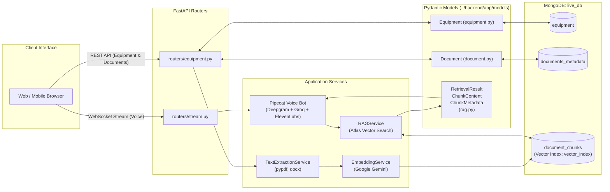
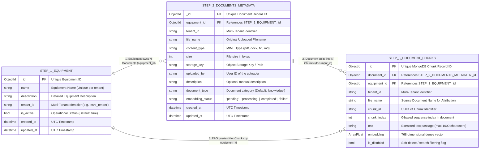
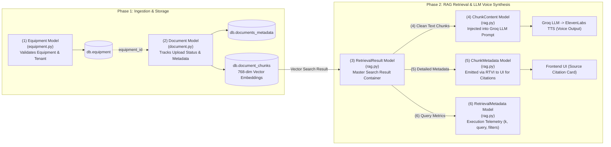

# Complete MongoDB Schema, Pydantic Models & Data Extraction Architecture

This document provides a comprehensive technical reference for the MongoDB database schemas, the Pydantic data models located in [`backend/app/models/`](../backend/app/models), and the end-to-end data extraction workflows in the **RAG Voice AI Agent** system.

---

## Table of Contents
1. [System Overview & Architecture](#1-system-overview--architecture)
2. [MongoDB Database Schemas](#2-mongodb-database-schemas)
   - [2.1 Entity Relationship Diagram (Numbered Data Flow)](#21-entity-relationship-diagram-numbered-data-flow)
   - [2.2 Collection: `equipment`](#22-collection-equipment)
   - [2.3 Collection: `documents_metadata`](#23-collection-documents_metadata)
   - [2.4 Collection: `document_chunks` & Vector Index](#24-collection-document_chunks--vector-index)
3. [Pydantic Domain Models](#3-pydantic-domain-models)
   - [3.1 Numbered Data Flow Pipeline](#31-numbered-data-flow-pipeline)
   - [3.2 Model Hierarchy & Numbered Class Structure](#32-model-hierarchy--numbered-class-structure)
   - [3.3 Custom Type: `PyObjectId`](#33-custom-type-pyobjectid)
   - [3.4 `Equipment` Model](#34-equipment-model)
   - [3.5 `Document` Model](#35-document-model)
   - [3.6 RAG Models (`ChunkContent`, `ChunkMetadata`, `RetrievalMetadata`, `RetrievalResult`)](#36-rag-models)
4. [Data Pipelines & Information Extraction Workflows](#4-data-pipelines--information-extraction-workflows)
   - [4.1 Pipeline A: Document Ingestion, Multi-Format Extraction & Embedding](#41-pipeline-a-document-ingestion-multi-format-extraction--embedding)
   - [4.2 Pipeline B: Real-Time Voice Bot RAG & Vector Retrieval](#42-pipeline-b-real-time-voice-bot-rag--vector-retrieval)
5. [Complete Field-to-Model Mapping Matrix](#5-complete-field-to-model-mapping-matrix)

---

## 1. System Overview & Architecture

The application connects to a MongoDB database named **`live_db`** (configured via [`backend/app/config.py`](../backend/app/config.py)).

- **Database Name**: `live_db`
- **Driver**: `pymongo.AsyncMongoClient` (PyMongo Async API)
- **Vector Search Engine**: MongoDB Atlas `$vectorSearch` with Cosine Similarity
- **Embeddings Provider**: Google Gemini (`google/text-embedding-004`, 768 dimensions)
- **STT Engine**: Deepgram Live STT
- **LLM Engine**: Groq (`openai/gpt-oss-20b` via Groq API)
- **TTS Engine**: ElevenLabs Live TTS
- **Voice Orchestration**: Pipecat AI Pipeline



---

## 2. MongoDB Database Schemas

### 2.1 Entity Relationship Diagram (Numbered Data Flow)



---

### 2.2 Collection: `equipment`

* **Purpose**: Stores equipment metadata, machinery models, or assets.
* **Indexes**: Unique compound index on `{"name": 1, "tenant_id": 1}`.
* **Schema Definition**:

| Field | BSON Type | Required | Default | Description |
| :--- | :--- | :--- | :--- | :--- |
| `_id` | `ObjectId` | Yes (Auto) | `ObjectId()` | Unique primary key for the equipment |
| `name` | `string` | Yes | — | Name of the equipment (e.g., "Air Compressor 500X") |
| `description` | `string` | Yes | — | Equipment specifications, function, or usage |
| `tenant_id` | `string` | Yes | — | Multi-tenancy isolation identifier |
| `is_active` | `bool` | Yes | `true` | Active/Inactive status flag |
| `created_at` | `date` | Yes | `now()` | UTC creation timestamp |
| `updated_at` | `date` | Yes | `now()` | UTC last update timestamp |

* **Sample Document**:
```json
{
  "_id": ObjectId("66c2d1f8e12b3c4d5e6f7a8b"),
  "name": "CAT 3516B Marine Generator",
  "description": "Heavy industrial marine diesel generator set for continuous power supply",
  "tenant_id": "mvp_tenant",
  "is_active": true,
  "created_at": ISODate("2026-08-19T07:15:00.000Z"),
  "updated_at": ISODate("2026-08-19T07:15:00.000Z")
}
```

---

### 2.3 Collection: `documents_metadata`

* **Purpose**: Tracks uploaded knowledge base documents, file storage keys, and background vector embedding states.
* **Indexes**: Index on `{"equipment_id": 1, "is_disabled": 1}`.
* **Schema Definition**:

| Field | BSON Type | Required | Default | Description |
| :--- | :--- | :--- | :--- | :--- |
| `_id` | `ObjectId` | Yes (Auto) | `ObjectId()` | Unique primary key for the document |
| `equipment_id` | `ObjectId` | Yes | — | Foreign key referencing `equipment._id` |
| `tenant_id` | `string` | Yes | — | Multi-tenancy identifier |
| `file_name` | `string` | Yes | — | Original file name (e.g., "manual.pdf") |
| `content_type` | `string` | Yes | — | MIME type (`application/pdf`, `text/plain`, etc.) |
| `size` | `int` | Yes | — | File size in bytes |
| `storage_key` | `string` | Yes | — | S3/Cloud Storage object key |
| `uploaded_by` | `string` | Yes | — | User ID of the uploader |
| `description` | `string` | No | `null` | Optional description of the document |
| `document_type`| `string` | Yes | `"knowledge"` | Category of document |
| `embedding_status` | `string` | Yes | `"pending"` | Processing status: `pending`, `processing`, `completed`, `failed` |
| `created_at` | `date` | Yes | `now()` | UTC creation timestamp |
| `updated_at` | `date` | Yes | `now()` | UTC last update timestamp |

* **Sample Document**:
```json
{
  "_id": ObjectId("66c2d205e12b3c4d5e6f7a8c"),
  "equipment_id": ObjectId("66c2d1f8e12b3c4d5e6f7a8b"),
  "tenant_id": "mvp_tenant",
  "file_name": "CAT_3516B_troubleshooting_guide.pdf",
  "content_type": "application/pdf",
  "size": 2458912,
  "storage_key": "mvp_tenant/equipment/66c2d1f8e12b3c4d5e6f7a8b/9f8e7d6c-CAT_3516B_troubleshooting_guide.pdf",
  "uploaded_by": "mvp_user",
  "description": "OEM technical troubleshooting guide for marine generator faults",
  "document_type": "knowledge",
  "embedding_status": "completed",
  "created_at": ISODate("2026-08-19T07:15:30.000Z"),
  "updated_at": ISODate("2026-08-19T07:16:05.000Z")
}
```

---

### 2.4 Collection: `document_chunks` & Vector Index

* **Purpose**: Stores text chunks split by `RecursiveCharacterTextSplitter` and their corresponding 768-dimensional Gemini vector embeddings.
* **Vector Index Definition (`vector_index`)**:
```json
{
  "fields": [
    {
      "type": "vector",
      "path": "embedding",
      "numDimensions": 768,
      "similarity": "cosine"
    },
    { "type": "filter", "path": "equipment_id" },
    { "type": "filter", "path": "tenant_id" },
    { "type": "filter", "path": "is_disabled" }
  ]
}
```

* **Schema Definition**:

| Field | BSON Type | Required | Default | Description |
| :--- | :--- | :--- | :--- | :--- |
| `_id` | `ObjectId` | Yes (Auto) | `ObjectId()` | Unique primary key for the chunk |
| `document_id` | `ObjectId` | Yes | — | Foreign key referencing `documents_metadata._id` |
| `equipment_id` | `ObjectId` | Yes | — | Foreign key referencing `equipment._id` |
| `tenant_id` | `string` | Yes | — | Multi-tenancy identifier |
| `file_name` | `string` | Yes | — | Source document name for citation |
| `chunk_id` | `string` | Yes | `uuid4()` | UUID v4 chunk identifier |
| `chunk_index` | `int` | Yes | `0` | Sequential position index in source document |
| `text` | `string` | Yes | — | Extracted text chunk content (max 1000 characters) |
| `embedding` | `Array<double>` | Yes | — | 768-dimensional vector embedding |
| `is_disabled` | `bool` | Yes | `false` | Soft-delete / exclusion filter |

* **Sample Document**:
```json
{
  "_id": ObjectId("66c2d209e12b3c4d5e6f7a8d"),
  "document_id": ObjectId("66c2d205e12b3c4d5e6f7a8c"),
  "equipment_id": ObjectId("66c2d1f8e12b3c4d5e6f7a8b"),
  "tenant_id": "mvp_tenant",
  "file_name": "CAT_3516B_troubleshooting_guide.pdf",
  "chunk_id": "b3e64bb0-08c3-4d7a-8fa5-7a6c52a0a2df",
  "chunk_index": 0,
  "text": "Fault Code 110-03: Engine Coolant Temperature Sensor open circuit. Inspect wiring harness between sensor terminal and ECM connector pin 42.",
  "embedding": [0.0124, -0.0451, 0.0893, "...(768 float dimensions)..."],
  "is_disabled": false
}
```

---

## 3. Pydantic Domain Models

All domain models reside in [`backend/app/models/`](../backend/app/models).

### 3.1 Numbered Data Flow Pipeline



### 3.2 Model Hierarchy & Numbered Class Structure

```mermaid
classDiagram
    direction LR

    class Model_1_Equipment {
        +Optional~PyObjectId~ id "_id"
        +str name
        +str description
        +str tenant_id
        +bool is_active
        +Optional~datetime~ created_at
        +Optional~datetime~ updated_at
        -- Step 1: Equipment Registration --
    }

    class Model_2_Document {
        +Optional~PyObjectId~ id "_id"
        +PyObjectId equipment_id
        +str tenant_id
        +str file_name
        +str content_type
        +int size
        +str storage_key
        +str uploaded_by
        +Optional~str~ description
        +str embedding_status
        +Optional~datetime~ created_at
        -- Step 2: Document Ingestion --
    }

    class Model_3_RetrievalResult {
        +List~ChunkContent~ data
        +RetrievalMetadata metadata
        -- Step 3: Vector Search Container --
    }

    class Model_4_ChunkContent {
        +str text
        +Optional~str~ file_name
        +Optional~float~ score
        -- Step 4: Clean Prompt Payload to LLM --
    }

    class Model_5_ChunkMetadata {
        +str chunk_id
        +str document_id
        +str equipment_id
        +Optional~str~ tenant_id
        +int chunk_index
        +float score
        +str file_name
        -- Step 5: Citation Telemetry to UI --
    }

    class Model_6_RetrievalMetadata {
        +str query
        +int k
        +int chunks_retrieved
        +Optional~str~ equipment_id
        +Optional~str~ tenant_id
        +List~ChunkMetadata~ chunks
        -- Step 6: Search Query Telemetry --
    }

    Model_1_Equipment ..> Model_2_Document : 1. Associated by equipment_id
    Model_2_Document ..> Model_3_RetrievalResult : 2. Chunks queried by RAG
    Model_3_RetrievalResult "1" *-- "many" Model_4_ChunkContent : 3. Contains clean text
    Model_3_RetrievalResult "1" *-- "1" Model_6_RetrievalMetadata : 4. Contains query metadata
    Model_6_RetrievalMetadata "1" *-- "many" Model_5_ChunkMetadata : 5. Contains chunk provenance
```



---

### 3.3 Custom Type: `PyObjectId`
Defined in both [`equipment.py`](../backend/app/models/equipment.py#L22-L29) and [`document.py`](../backend/app/models/document.py#L22-L29).

* **Purpose**: Bridges MongoDB BSON `ObjectId` with standard Python `str` in Pydantic V2.
* **Inbound (`BeforeValidator`)**: Converts valid hex string or existing `ObjectId` to `bson.ObjectId`.
* **Outbound (`PlainSerializer`)**: Serializes `bson.ObjectId` to `str` for JSON API responses.

---

### 3.4 `Equipment` Model
Located at: [`backend/app/models/equipment.py`](../backend/app/models/equipment.py)

```python
class Equipment(BaseModel):
    id: Optional[PyObjectId] = Field(default=None, alias="_id", serialization_alias="_id")
    name: str = Field(..., description="Name of the equipment")
    description: str = Field(..., description="Detailed equipment description")
    tenant_id: str = Field(..., description="Multi-tenancy identifier")
    is_active: bool = Field(default=True, description="Status of the equipment")
    created_at: Optional[datetime] = Field(default_factory=lambda: datetime.now(timezone.utc))
    updated_at: Optional[datetime] = Field(default_factory=lambda: datetime.now(timezone.utc))
```
* **Project Use**:
  1. Validates equipment creation in `POST /api/v1/equipment/`.
  2. Serializes equipment lists for `GET /api/v1/equipment/`.
  3. Verifies equipment existence before establishing WebSocket voice sessions.

---

### 3.5 `Document` Model
Located at: [`backend/app/models/document.py`](../backend/app/models/document.py)

```python
class Document(BaseModel):
    id: Optional[PyObjectId] = Field(default=None, alias="_id", serialization_alias="_id")
    equipment_id: PyObjectId = Field(..., description="Associated equipment reference ID")
    tenant_id: str = Field(..., description="Multi-tenancy identifier")
    file_name: str = Field(..., description="Original name of the uploaded file")
    content_type: str = Field(..., description="MIME type of the file")
    size: int = Field(..., ge=0, description="File size in bytes")
    storage_key: str = Field(..., description="Cloud storage object key or path")
    uploaded_by: str = Field(..., description="User ID or email of the uploader")
    description: Optional[str] = Field(default=None)
    embedding_status: str = Field(default="pending")
    embedding_error: Optional[dict] = Field(default=None)
    created_at: Optional[datetime] = Field(default_factory=lambda: datetime.now(timezone.utc))
    updated_at: Optional[datetime] = Field(default_factory=lambda: datetime.now(timezone.utc))
```
* **Project Use**:
  1. Validates document records created in `POST /{equipment_id}/documents`.
  2. Tracks vectorization status (`processing` $\rightarrow$ `completed` / `failed`).
  3. Returns serialized document metadata in `GET /{equipment_id}/documents`.

---

### 3.6 RAG Models
Located at: [`backend/app/models/rag.py`](../backend/app/models/rag.py)

| Model Name | Fields | Description & Purpose |
| :--- | :--- | :--- |
| **`ChunkContent`** | `text: str`<br>`file_name: Optional[str]`<br>`score: Optional[float]` | **Clean text payload for LLM**: Contains only factual text and relevance score. Strips out internal database IDs to keep prompt tokens clean and prevent LLM confusion. |
| **`ChunkMetadata`** | `chunk_id: str`<br>`document_id: str`<br>`equipment_id: str`<br>`tenant_id: Optional[str]`<br>`chunk_index: int`<br>`score: float`<br>`file_name: str` | **Detailed telemetry**: Encapsulates complete provenance of each retrieved chunk. Emitted to the frontend UI via RTVI WebSocket messages for live citations. |
| **`RetrievalMetadata`**| `query: str`<br>`k: int`<br>`chunks_retrieved: int`<br>`equipment_id: Optional[str]`<br>`tenant_id: Optional[str]`<br>`chunks: list[ChunkMetadata]` | **Execution telemetry**: Records the original query string, $k$ value, filters applied, and list of chunk metadata. |
| **`RetrievalResult`** | `data: list[ChunkContent]`<br>`metadata: RetrievalMetadata` | **Composite response**: Unified return type of [`RAGService.retrieve()`](../backend/app/services/rag.py#L81) containing both LLM context and search metrics. |

---

## 4. Data Pipelines & Information Extraction Workflows

### 4.1 Pipeline A: Document Ingestion, Multi-Format Extraction & Embedding

```mermaid
flowchart LR
    A["1. User uploads File (.pdf, .docx, .txt, .md)\nPOST /{equipment_id}/documents"] --> B{"2. Validate Equipment Exists\n(db.equipment)"}
    B -- No --> C["Return HTTP 404"]
    B -- Yes --> D["3. TextExtractionService.extract_text()\n(services/text_extraction.py)"]

    subgraph Extractors ["Multi-Format Text Extraction"]
        PDF["pypdf.PdfReader\n(Iterate pages & concatenate)"]
        DOCX["docx.Document\n(Extract paragraphs & tables)"]
        TXT["UTF-8 / Latin-1 Stream Reader"]
    end

    D --> Extractors
    Extractors --> E["4. EmbeddingService.split_text()\n(Chunk Size: 1000, Chunk Overlap: 250)"]

    E --> F["5. Insert Metadata (embedding_status: 'processing')\n-> db.documents_metadata"]
    
    F --> G["6. EmbeddingService.embed_text(chunk_text)\n(Google text-embedding-004 -> 768 floats)"]

    G --> H["7. Bulk Insert into db.document_chunks"]
    H --> I["8. Update Metadata (embedding_status: 'completed')\n-> db.documents_metadata"]
    I --> J["9. Return Serialized Document List"]
```



---

### 4.2 Pipeline B: Real-Time Voice Bot RAG & Vector Retrieval

```mermaid
flowchart LR
    UserVoice["1. User speaks into Microphone"] --> StreamWS["2. WebSocket /api/v1/stream/ws/{equipment_id}\n(routers/stream.py)"]
    StreamWS --> STT["3. Deepgram STT (Real-time Speech-to-Text)"]
    STT --> LLMCheck{"4. Groq LLM Evaluates Query\nNeeds knowledge base?"}
    
    LLMCheck -- No --> SpeakDirect["Direct Spoken Answer"]
    LLMCheck -- Yes --> ToolCall["5. LLM triggers Tool:\nsearch_knowledge_base(query)"]
    
    ToolCall --> RAGServ["6. RAGService.retrieve(query, equipment_id)\n(services/rag.py)"]
    
    subgraph VectorSearchPipeline ["MongoDB Atlas Vector Search"]
        EmbedQuery["Generate Query Vector (Gemini 768-dim)"]
        BuildFilter["Build Filter: equipment_id + is_disabled!=True"]
        ExecuteVector["Execute $vectorSearch Aggregation Pipeline\nIndex: 'vector_index', limit: 5"]
        EmbedQuery --> ExecuteVector
        BuildFilter --> ExecuteVector
    end
    
    RAGServ --> VectorSearchPipeline
    ExecuteVector --> Unpack["7. Unpack Mongo BSON matches into Pydantic Models:\n- ChunkContent (data)\n- ChunkMetadata (metadata.chunks)"]
    
    Unpack --> FeedLLM["8. Feed ChunkContent into Groq LLM Context"]
    Unpack --> EmitRTVI["9. Push RTVIServerMessageFrame\n(ChunkMetadata -> Frontend UI for citation)"]
    
    FeedLLM --> GroqGen["10. Groq LLM synthesizes concise spoken answer (<30 words)"]
    GroqGen --> TTS["11. ElevenLabs TTS generates voice audio stream"]
    TTS --> VoiceOut(["12. Stream audio response back to User"])
```



---

## 5. Complete Field-to-Model Mapping Matrix

| MongoDB Collection | MongoDB Field | Type | Mapped Pydantic Model | Pydantic Field | Used By / Target Component |
| :--- | :--- | :--- | :--- | :--- | :--- |
| `equipment` | `_id` | `ObjectId` | [`Equipment`](../backend/app/models/equipment.py#L36) | `id` (alias `_id`) | REST API clients, WebSocket router session validation |
| `equipment` | `name` | `string` | [`Equipment`](../backend/app/models/equipment.py#L43) | `name` | Duplicate equipment name prevention |
| `equipment` | `description` | `string` | [`Equipment`](../backend/app/models/equipment.py#L44) | `description` | Dashboard UI display |
| `equipment` | `tenant_id` | `string` | [`Equipment`](../backend/app/models/equipment.py#L45) | `tenant_id` | Multi-tenant query isolation |
| `equipment` | `is_active` | `bool` | [`Equipment`](../backend/app/models/equipment.py#L47) | `is_active` | Soft-delete / operational status check |
| `documents_metadata` | `_id` | `ObjectId` | [`Document`](../backend/app/models/document.py#L36) | `id` (alias `_id`) | Foreign key linking chunks to documents |
| `documents_metadata` | `equipment_id` | `ObjectId` | [`Document`](../backend/app/models/document.py#L43) | `equipment_id` | Foreign key linking documents to equipment |
| `documents_metadata` | `file_name` | `string` | [`Document`](../backend/app/models/document.py#L48) | `file_name` | Filename display and chunk attribution |
| `documents_metadata` | `embedding_status` | `string` | [`Document`](../backend/app/models/document.py#L61) | `embedding_status` | Ingestion status (`pending` $\rightarrow$ `completed` / `failed`) |
| `document_chunks` | `chunk_id` | `string` | [`ChunkMetadata`](../backend/app/models/rag.py#L16) | `chunk_id` | Frontend citation card key |
| `document_chunks` | `text` | `string` | [`ChunkContent`](../backend/app/models/rag.py#L8) | `text` | Clean context injected into Groq LLM prompt |
| `document_chunks` | `file_name` | `string` | [`ChunkContent`](../backend/app/models/rag.py#L9) / [`ChunkMetadata`](../backend/app/models/rag.py#L22) | `file_name` | Source attribution in LLM & UI citations |
| `document_chunks` | `embedding` | `Array<double>` | *(Vector Index)* | *(Vector Index)* | MongoDB Atlas `$vectorSearch` similarity matching |
| `document_chunks` | `$meta: vectorSearchScore` | `float` | [`ChunkContent`](../backend/app/models/rag.py#L10) / [`ChunkMetadata`](../backend/app/models/rag.py#L21) | `score` | Relevance ranking and confidence scoring |
