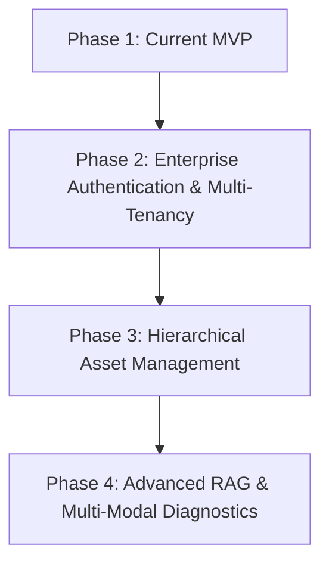

# 🚀 Future Updates & Enterprise Expansion Roadmap

<details><summary>Here are the **deep technical & architectural reasons** behind all 5 behaviors:

---

### 1. Why Phantom Sources Appear (`Sources: 1706.03762v7.pdf` on failed searches)
* **Architecture Code Path**:
  1. User asks a question ➔ Groq LLM triggers the `search_knowledge_base` tool function.
  2. The function queries MongoDB `$vectorSearch` and gets back the 3 nearest vector matches (which happen to be from `1706.03762v7.pdf`).
  3. The backend sends the retrieved chunk metadata (`sources: ["1706.03762v7.pdf"]`) down the WebSocket to the frontend **immediately** upon tool execution.
  4. The LLM reads the retrieved text, realizes it has nothing to do with "Einstein" or "anapolar", and answers *"I couldn't find information in the knowledge base"*.
* **Root Cause**: The source metadata frame is emitted **unconditionally when vector search runs**, regardless of whether the LLM accepts or rejects the context content.

---

### 2. Why Sentences Sliced Into 2–3 Bubbles ("Give me a summary of" ➔ "Einstein")
* **Architecture Code Path**:
  1. `SileroVADAnalyzer` processes microphone audio frames continuously in 20ms chunks.
  2. It measures silence duration against `VADParams(stop_secs=0.2)`.
* **Root Cause**: **200 milliseconds (`0.2s`) is shorter than a natural human breath pause.** 
  When you say *"Give me a summary of..."* and pause for 250ms to think of the word *"Einstein"*, the VAD silence timer expires at 200ms. It flags `SpeechState.STOP`, forces `LLMUserAggregator` to finalize the turn, and sends the incomplete fragment to the backend. When you finally say *"Einstein"*, it triggers a second independent turn.

---

### 3. Why Prompt Says "Equipment Assistant" but Output Says "No equipment manuals found"
* **Architecture Data Path**:
  - **System Prompt** (`bot.py`): Hardcoded to say *"You are an AI equipment diagnostic assistant..."*
  - **MongoDB Vector Collection** (`live_db.chunks`): Currently contains embeddings for `1706.03762v7.pdf` (the Google "Attention Is All You Need" AI paper).
* **Root Cause**: **Prompt vs. Knowledge Base Mismatch.** The LLM is instructed to act like an equipment repair assistant, but when it queries MongoDB, it receives Transformer neural network research text. Recognizing that a research paper is not an equipment manual, the LLM literally responds: *"No equipment manuals found."*

---

### 4. Why Saying "Wait." Repeated the Entire 2-Point Answer
* **Architecture Context Path**:
  1. STT transcribes the audio input as `"Wait."`.
  2. `LLMUserAggregator` appends `{"role": "user", "content": "Wait."}` to the context window right after the previous encoder answer.
* **Root Cause**: **Lack of Intent Handler for Control Words.** The LLM context prompt has no special handling for conversational pause commands ("wait", "hold on", "stop"). Because the LLM receives `"Wait."` with no specific question, it assumes you wanted clarification on its last output, re-generating the 2 sub-layers of the encoder.

---

### 5. Why "encoder and decoder" Became "anapolar and decolor"
* **Architecture Speech Path**:
  - Deepgram's legacy default model (`base`/`nova-1`) without explicit language parameters (`language="en"`).
* **Root Cause**: **Acoustic Phoneme Substitution.** In speech phonetics, `/ɪnˈkoʊdər/` (encoder) and `/ænəˈpoʊlər/` (anapolar) share identical formant frequencies (nasal onset + mid-vowels + `o-d-e-r` tail). Without `nova-3`'s contextual language model, the legacy STT model mapped the fuzzy audio signal to dictionary words ("anapolar", "decolor").

</details></summary>


This document outlines planned future architectural enhancements, enterprise upgrades, and production readiness roadmap for the **Industrial Voice Agent & RAG System**.

---

## 📅 Roadmap Overview



---

## 🔐 1. Enterprise Multi-Tenancy & Auth (Phase 2)

### Current MVP Implementation
* Documents and equipment items store `tenant_id` string in MongoDB.
* When selecting an equipment item, `tenant_id` is derived from the equipment record and passed to the RAG vector search filter pipeline.

### Planned Enterprise Upgrade
* **JWT Authentication Integration (OAuth2 / OIDC)**:
  * Integrate SSO providers (Auth0, Azure AD, Okta, or Keycloak).
  * Extract `tenant_id` cryptographically from the user's JWT bearer token (`request.state.user.tenant_id`).
* **Hard Tenant Isolation**:
  * Enforce tenant isolation at the API Gateway / Middleware layer.
  * Prevent users from accessing equipment or knowledge base chunks belonging to other tenants.

#### Code Architecture Blueprint (`app/middleware/auth.py`):
```python
# Planned future middleware implementation
from fastapi import Request, HTTPException, status
import jwt

async def verify_jwt_tenant(request: Request):
    token = request.headers.get("Authorization")
    if not token or not token.startswith("Bearer "):
        raise HTTPException(status_code=401, detail="Unauthorized")
    
    payload = jwt.decode(token.split(" ")[1], options={"verify_signature": True})
    request.state.tenant_id = payload.get("tenant_id")
    request.state.user_id = payload.get("sub")
```

---

## 🏢 2. Hierarchical Asset Model (Phase 3)

### Current Structure
```text
Equipment ──► Knowledge Documents ──► Vector Chunks
```

### Planned Enterprise Structure
```text
Organization (Tenant)
    └── Facility / Plant (e.g. Chicago Manufacturing Plant)
         └── Production Line (e.g. Line B)
              └── Equipment / Asset (e.g. Generator #3)
                   └── Knowledge Manuals & Audio Logs
```

### Features to Add:
* **Plant & Line CRUD Endpoints**: `/api/v1/plants`, `/api/v1/lines`.
* **Inherited Context Filtering**: RAG queries can be scoped broadly (all machines in Plant A) or granularly (specific generator).

---

## ⚡ 3. Advanced RAG & Vector Engine Upgrades (Phase 4)

### Planned Enhancements:
1. **Hybrid Search (Dense + Sparse/BM25)**:
   * Combine MongoDB Atlas Vector Search with keyword search (BM25) for technical serial numbers and error code matching.
2. **Re-Ranking Pipeline**:
   * Add a Cohere or BAAI Cross-Encoder re-ranker stage to score retrieved chunks before passing to LLM context window.
3. **Multi-Modal Document Parsing**:
   * Support OCR and diagram extraction from engineering schematics (PDF drawings, CAD exports).

---

## 🛠️ Summary of Recent System Fixes Completed

| Component | Description | Status |
| :--- | :--- | :--- |
| **PyMongo Async Aggregate** | Added `await` to `collection.aggregate(pipeline)` in `app/services/rag.py` | ✅ Completed |
| **Tenant ID Sync** | Fixed document upload route in `app/routers/equipment.py` to inherit equipment `tenant_id` | ✅ Completed |
| **Batch Embedding** | Optimized text chunk embedding using 32-chunk batching in `app/services/embeddings.py` | ✅ Completed |
| **OpenAPI Schema Fix** | Injected `format: "binary"` into FastAPI OpenAPI 3.1 schema for Swagger UI uploads | ✅ Completed |
| **WebSocket Teardown** | Restored `websocket.accept()` and hardened client connection lifecycle handling | ✅ Completed |

---

*Last updated: August 2026*
