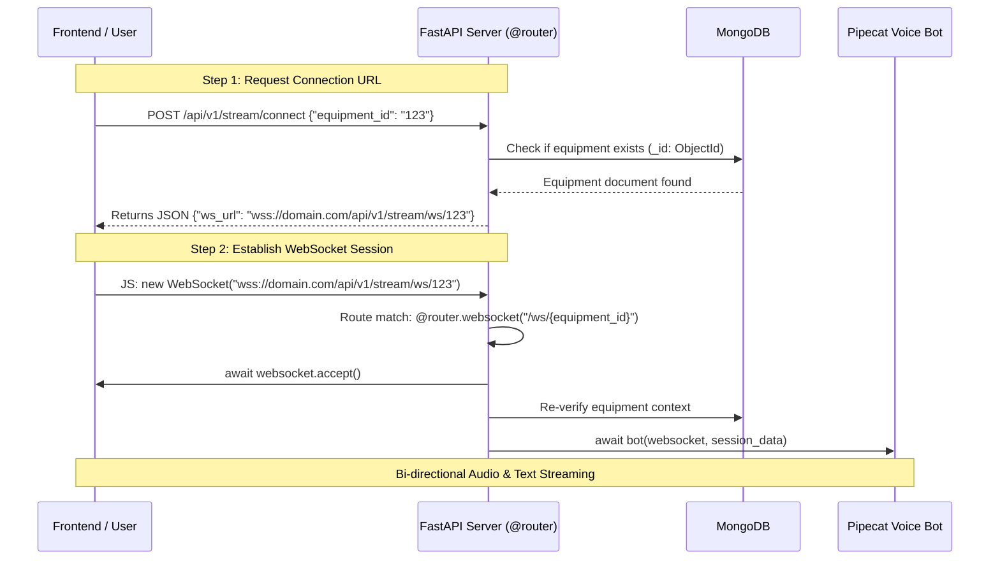

# WebSocket Connection & Stream Flow Architecture

This document explains how the WebSocket connection is established, validated, and proxied between the frontend client and the FastAPI backend service.

---

## Connection Sequence Diagram



---

## Detailed Step-by-Step Breakdown

### 1. Connection Initialization (`POST /api/v1/stream/connect`)
* The client sends a REST POST request containing `{"equipment_id": "<ID>"}`.
* **Validation:** The server parses the request body using `ConnectRequest` (Pydantic) and validates MongoDB `ObjectId` format.
* **Dynamic Scheme & Host Resolution:** To support production setups behind AWS ALB, Nginx, or reverse proxies:
  ```python
  forwarded_proto = request.headers.get("X-Forwarded-Proto", request.url.scheme)
  forwarded_host = request.headers.get("X-Forwarded-Host", request.url.netloc)

  ws_scheme = "wss" if forwarded_proto == "https" else "ws"
  ws_url = f"{ws_scheme}://{forwarded_host}/api/v1/stream/ws/{payload.equipment_id}"
  ```
* **Result:** Returns `{"ws_url": ws_url}` to the client.

### 2. WebSocket Session Handshake (`WS /api/v1/stream/ws/{equipment_id}`)
* The client initiates standard WebSocket handshake: `const socket = new WebSocket(data.ws_url)`.
* FastAPI accepts the WebSocket connection (`await websocket.accept()`).
* Session metadata (`equipment_id`, `tenant_id`, `session_id`, `user_id`) is compiled into `session_data`.
* Server hands off control to Pipecat voice bot runner (`await bot(websocket, session_data)`).

---

## Transport Design Decision: TCP WebSocket vs UDP (WebRTC)

### Why We Use TCP-Based WebSocket (FastAPIWebsocketTransport)

This project uses Pipecat's FastAPIWebsocketTransport over a persistent TCP WebSocket connection instead of a UDP-based transport (e.g., WebRTC via SmallWebRTC or DailyTransport).

### Reason 1: This is an AI Pipeline, Not a Raw Voice Call

The audio stream passes through a sequential processing pipeline where every stage depends on the complete, ordered, and intact output of the previous stage:

  Client Mic Audio
        -> FastAPIWebsocketTransport (TCP WebSocket)
        -> SileroVADAnalyzer         (Voice Activity Detection)
        -> DeepgramSTTService        (Speech-to-Text)
        -> GroqLLMService            (LLM Reasoning + Tool Calls)
        -> ElevenLabsTTSService      (Text-to-Speech synthesis)
        -> FastAPIWebsocketTransport (TCP WebSocket -> Client Speaker)

UDP's fire-and-forget model is incompatible with this ordered pipeline:
- A dropped STT chunk -> wrong transcription -> wrong LLM input
- A dropped LLM token -> broken or truncated sentence
- A dropped TTS frame -> garbled audio playback
- A dropped RTVI control event -> session state corruption

### Reason 2: All Data Frames Are Order-Sensitive

The transport uses ProtobufFrameSerializer (binary Protobuf frames) carrying:
- Raw audio chunks (mic input)
- RTVI protocol control messages (bot-ready, on_client_ready)
- Transcription text frames
- TTS synthesized audio frames
- Session lifecycle events (connect / disconnect)

All frames are sequenced and stateful. TCP guarantees delivery order; UDP does not.

### Reason 3: FastAPI Native Integration — No Extra Infrastructure

FastAPIWebsocketTransport integrates directly into FastAPI with zero additional services:

\\python
transport = FastAPIWebsocketTransport(
    websocket=websocket,
    params=FastAPIWebsocketParams(
        audio_in_enabled=True,
        audio_out_enabled=True,
        serializer=ProtobufFrameSerializer(),
        vad_analyzer=SileroVADAnalyzer(params=VADParams(stop_secs=0.2)),
    ),
)
\
Switching to WebRTC would require: a separate SDP signaling endpoint, STUN/TURN server for NAT traversal, ICE candidate negotiation, and matching client-side WebRTC SDK — complexity not justified at current scale.

### Reason 4: Pipecat's Own Guidance for This Pattern

Per Pipecat's official transport documentation, WebSocket is the recommended transport for server-to-server communication, telephony integrations, and controlled network environments. This project runs on server infrastructure (AWS ALB -> EC2/container) with controlled networking, making TCP acceptable. WebRTC (UDP) is recommended only when raw peer-to-peer audio latency is the primary concern in consumer apps with unpredictable mobile networks.

### When to Consider Migrating to WebRTC

Migrate to SmallWebRTC or DailyTransport (UDP-based) only if:
- Consistent audio stuttering is observed in production
- Round-trip latency exceeds 400ms end-to-end
- Targeting high packet-loss mobile network environments
- Scaling to thousands of concurrent sessions needing media optimization

### Summary Table

| Factor                        | TCP WebSocket     | UDP WebRTC                    |
|-------------------------------|-------------------|-------------------------------|
| Pipeline data integrity       | Guaranteed        | Packet loss possible          |
| Frame ordering                | Preserved         | Out-of-order possible         |
| FastAPI integration           | Native            | Requires signaling layer      |
| Extra infrastructure needed   | None              | STUN/TURN server required     |
| Latency (raw audio)           | ~150-300ms        | ~50-150ms                     |
| Suitable for this AI pipeline | Yes               | Overkill for current scale    |

Decision: TCP WebSocket (FastAPIWebsocketTransport) is the correct transport choice for this AI voice pipeline at its current architecture and scale.
