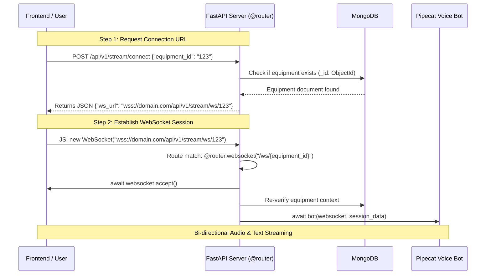

# WebSocket Connection & Stream Flow Architecture

This document explains how the WebSocket connection is established, validated, and proxied between the frontend client and the FastAPI backend service.

---

## Connection Sequence Diagram



---

## Detailed Step-by-Step Breakdown

### 1. Connection Initialization (`POST /api/v1/stream/connect`)
* The client sends a REST POST request containing `{"equipment_id": "<ID>"}`.
* **Validation:** The server parses the request body using `ConnectRequest` (Pydantic) and validates MongoDB `ObjectId` format.
* **Dynamic Scheme & Host Resolution:** To support production setups behind AWS ALB, Nginx, or reverse proxies:
  ```python
  forwarded_proto = request.headers.get("X-Forwarded-Proto", request.url.scheme)
  forwarded_host = request.headers.get("X-Forwarded-Host", request.url.netloc)

  ws_scheme = "wss" if forwarded_proto == "https" else "ws"
  ws_url = f"{ws_scheme}://{forwarded_host}/api/v1/stream/ws/{payload.equipment_id}"
  ```
* **Result:** Returns `{"ws_url": ws_url}` to the client.

### 2. WebSocket Session Handshake (`WS /api/v1/stream/ws/{equipment_id}`)
* The client initiates standard WebSocket handshake: `const socket = new WebSocket(data.ws_url)`.
* FastAPI accepts the WebSocket connection (`await websocket.accept()`).
* Session metadata (`equipment_id`, `tenant_id`, `session_id`, `user_id`) is compiled into `session_data`.
* Server hands off control to Pipecat voice bot runner (`await bot(websocket, session_data)`).
