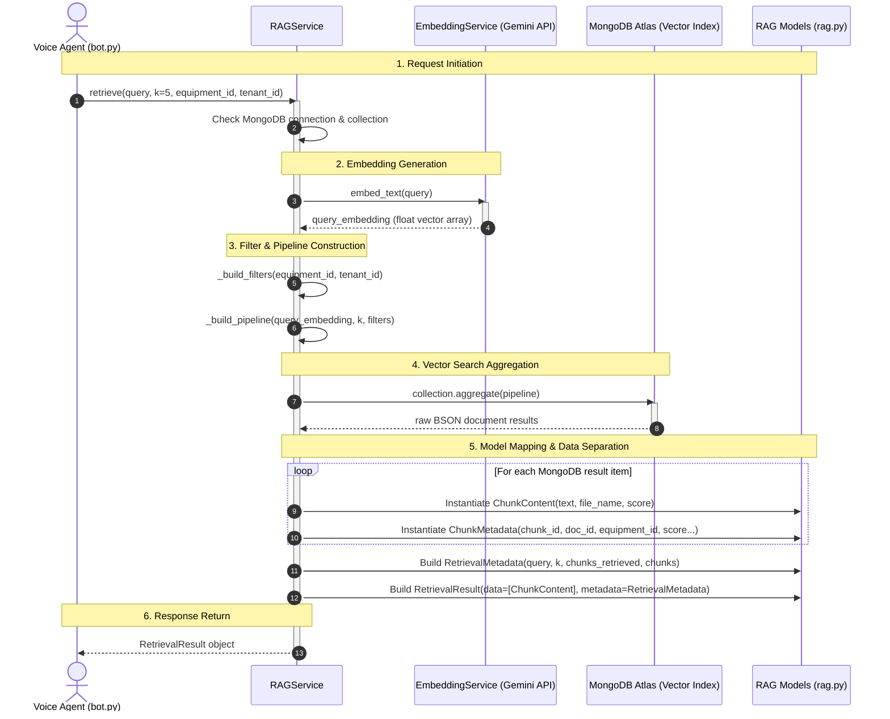

# 🎙️ Voice Agent Backend & RAG System — Production Architecture & Developer Progress Guide

[](https://www.python.org/)
[](https://fastapi.tiangolo.com/)
[](https://www.mongodb.com/products/platform/atlas-vector-search)
[](https://docs.pydantic.dev/)
[](https://motor.readthedocs.io/)

> **Project Mission**: A multi-tenant, voice-enabled Retrieval-Augmented Generation (RAG) AI assistant for equipment diagnostics, machinery troubleshooting, and technical manual lookup.

---

## 📌 Table of Contents

1. [🚀 Quickstart & Virtual Environment](#1--quickstart--virtual-environment)
2. [🗄️ Database & Vector Index Configuration](#2-️-database--vector-index-configuration)
   - [MongoDB Vector Index Schema](#mongodb-vector-index-schema)
   - [Async Database Connection Handler (`app/database.py`)](#async-database-connection-handler-appdatabasepy)
   - [Environment Configuration (`app/config.py`)](#environment-configuration-appconfigpy)
   - [MongoDB Driver Timeout Settings](#mongodb-driver-timeout-settings)
3. [📐 Domain Architecture & Entity Modeling](#3--domain-architecture--entity-modeling)
   - [Entity Relationship Diagram (ERD)](#entity-relationship-diagram-erd)
   - [The 4-Category Model Design Pattern](#the-4-category-model-design-pattern)
   - [Detailed Breakdown of Codebase Entities](#detailed-breakdown-of-codebase-entities)
   - [Entity Summary Matrix](#entity-summary-matrix)
   - [Multi-Tenancy & 1-to-Many Relationships](#multi-tenancy--1-to-many-relationships)
   - [The 4-Step Mental Formula for System Design](#the-4-step-mental-formula-for-system-design)
4. [📁 Equipment & Document Ingestion Workflow](#4--equipment--document-ingestion-workflow)
   - [File Upload Routing (`app/routers/equipment.py`)](#file-upload-routing-approutersequipmentpy)
   - [Cloud Storage Key Convention](#cloud-storage-key-convention)
   - [Embedding Lifecycle Tracking](#embedding-lifecycle-tracking)
5. [🧰 Custom Pydantic Types & MIME Types Guide](#5--custom-pydantic-types--mime-types-guide)
   - [BSON ObjectId Serialization (`BeforeValidator` & `PlainSerializer`)](#bson-objectid-serialization-beforevalidator--plainserializer)
   - [MIME Types Guide & Format Cheat Sheet](#mime-types-guide--format-cheat-sheet)
   - [Embedding Progress Logging Throttle](#embedding-progress-logging-throttle)
6. [🧠 RAG Data Model Architecture (`app/models/rag.py`)](#6--rag-data-model-architecture-appmodelsragpy)
   - [Data Separation Framework](#data-separation-framework)
   - [Step-by-Step Pydantic Schema Definitions](#step-by-step-pydantic-schema-definitions)
   - [5-Point RAG Model Checklist](#5-point-rag-model-checklist)
   - [End-to-End Retrieval Sequence Diagram](#end-to-end-retrieval-sequence-diagram)
   - [Real-Life Retrieval Response Payload](#real-life-retrieval-response-payload)
   - [Bot Consumption Architecture (`app/bot.py`)](#bot-consumption-architecture-appbotpy)
   - [30-Second Copy-Paste Blueprint](#30-second-copy-paste-blueprint)
   - [ID Field Typing Rules](#id-field-typing-rules)
7. [🔍 MongoDB Atlas Vector Search Pipeline Architecture](#7--mongodb-atlas-vector-search-pipeline-architecture)
   - [The `$vectorSearch` Aggregation Stage](#the-vectorsearch-aggregation-stage)
   - [Vector Search Architecture & MQL-to-Python Mapping](#vector-search-architecture--mql-to-python-mapping)
   - [Pipeline Execution Flowchart](#pipeline-execution-flowchart)
   - [Metadata Projection & Similarity Scoring (`$project`)](#metadata-projection--similarity-scoring-project)
   - [Why Aggregation Pipelines are Lists](#why-aggregation-pipelines-are-lists)
8. [⚡ Production RAG Service Implementation (`app/services/rag.py`)](#8--production-rag-service-implementation-appservicesragpy)
   - [Official MongoDB Documentation Pattern vs Production Service](#official-mongodb-documentation-pattern-vs-production-service)
   - [Production `RAGService` Class Implementation](#production-ragservice-class-implementation)
   - [Architectural Comparison & Key Enhancements](#architectural-comparison--key-enhancements)
9. [📚 Developer Reference & Documentation Resources](#9--developer-reference--documentation-resources)
   - [Documentation Index](#documentation-index)
   - [Official Documentation Links](#official-documentation-links)
   - [Google Search Keywords Cheat Sheet](#google-search-keywords-cheat-sheet)
   - [Local Project Reference Files](#local-project-reference-files)
   - [Recommended System Diagramming Tools](#recommended-system-diagramming-tools)
   - [Specific Links for Components Used in Your Project](#-1-specific-links-for-components-used-in-your-project)
   - [Specific Links for Future Capabilities](#-2-specific-links-for-future-capabilities)
10. [🎙️ Overview of Pipecat](#overview-of-pipecat)
   - [What You'll Learn](#what-youll-learn)
   - [Why Voice AI is Challenging](#why-voice-ai-is-challenging)
   - [Pipecat's Solution](#pipecats-solution)
   - [Core Architecture Concepts](#core-architecture-concepts)
   - [Voice AI Processing Flow](#voice-ai-processing-flow)
   - [Pipeline Architecture](#pipeline-architecture)
   - [What's Next](#whats-next)
---

## 1. 🚀 Quickstart & Virtual Environment

Activate the Python virtual environment in WSL / Linux terminal:

```bash
source .venv/bin/activate
```

---

## 2. 🗄️ Database & Vector Index Configuration

- **Database Name**: `live_db`
- **Collection Name**: `document_chunks`

### MongoDB Vector Index Schema

Configured on MongoDB Atlas Vector Search for the `document_chunks` collection:

```json
{
  "fields": [
    {
      "numDimensions": 384,
      "path": "embedding",
      "similarity": "cosine",
      "type": "vector"
    },
    {
      "path": "equipment_id",
      "type": "filter"
    }
  ]
}
```

### Async Database Connection Handler (`app/database.py`)

Handles asynchronous connections to MongoDB via `pymongo.AsyncMongoClient` / `Motor`:

```python
from pymongo import AsyncMongoClient
from pymongo.asynchronous.database import AsyncDatabase
from app.config import settings
from loguru import logger

client: AsyncMongoClient | None = None
database: AsyncDatabase | None = None 

async def connect_to_mongo():
    global client, database
    try:
        client = AsyncMongoClient(
            settings.MONGO_URI,
        ) 
        database = client[settings.DB_NAME]
        await client.admin.command('ping')
        logger.info(f"✅ Connected to MongoDB: {settings.DB_NAME}")
    except Exception as e:
        logger.error(f"❌ Failed to connect to MongoDB: {str(e)}")
        raise

async def close_mongo_connection():
    """Close database connection."""
    global client 
    if client:
        await client.close()
        logger.info("✅ MongoDB connection closed")

def get_database() -> AsyncDatabase:
    """Get database instance."""
    return database
```

### Environment Configuration (`app/config.py`)

Uses `pydantic-settings` to safely load environment variables from `.env`:

```python
from pydantic_settings import BaseSettings, SettingsConfigDict

class Settings(BaseSettings):
    MONGO_URI: str 
    DB_NAME: str = "live_db"

    model_config = SettingsConfigDict(
        env_file=".env",
        case_sensitive=True,
        extra="ignore"
    )

settings = Settings()
```

### MongoDB Driver Timeout Settings

| Setting | Real-World Analogy | Technical Purpose |
| :--- | :--- | :--- |
| **`serverSelectionTimeoutMS`** | *How long will you spend trying to find the correct phone number?* | Maximum time the driver will wait to discover a suitable, healthy cluster server. |
| **`connectTimeoutMS`** | *Once you dial, how long will you let it ring before hanging up?* | Maximum time allowed to establish the initial TCP connection. |
| **`socketTimeoutMS`** | *Once the other person answers, how long will you wait for them to respond to your question?* | Maximum time to wait for a database query response over an active connection. |

---

## 3. 📐 Domain Architecture & Entity Modeling

### Entity Relationship Diagram (ERD)

```text
┌───────────────────┐
│      Tenant       │
└─────────┬─────────┘
          │ (1-to-many)
          ▼
┌───────────────────┐
│     Equipment     │
└─────────┬─────────┘
          │ (1-to-many)
          ▼
┌───────────────────┐
│     Document      │
└─────────┬─────────┘
          │ (1-to-many)
          ▼
┌───────────────────┐
│ RAG Chunk / Vector│
└───────────────────┘
```

### The 4-Category Model Design Pattern

When designing data models for any entity (`Equipment`, `User`, `Document`, `Order`), structure fields across **4 key categories**:

| Category | Field Names | Why You Need It | Example |
| :--- | :--- | :--- | :--- |
| **1. Unique Identifier** | `id`, `_id` | Uniquely identifies the record in the database. | `"eq_98234"` or `ObjectId` |
| **2. Multi-Tenancy** | `tenant_id`, `org_id` | Enforces SaaS data isolation so organizations only query their own data. | `"org_acme_corp"` |
| **3. Status & Lifecycle** | `is_active`, `status` | Supports soft deletion (disabling instead of permanently dropping records). | `True` / `False` or `"active"` |
| **4. Audit Timestamps** | `created_at`, `updated_at` | Tracks creation and modification times for auditing and debugging. | `2026-08-06T00:18:00Z` |

#### Quick Checklist for Any New Model

```python
from typing import Optional
from datetime import datetime
from pydantic import BaseModel

class YourNewEntity(BaseModel):
    # 1. Identity & System Metadata
    id: Optional[str] = None
    tenant_id: str                          # Multi-tenant isolation
    is_active: bool = True                  # Soft deletion flag
    created_at: Optional[datetime] = None   # Creation timestamp
    updated_at: Optional[datetime] = None   # Last modification timestamp
    
    # 2. Core Business Fields (Custom per entity)
    name: str                               # What is it called?
    description: str                        # What details describe it?
    
    # 3. Relationships & Links
    # category_id: Optional[str] = None     # Related entity foreign keys
```

**Summary of How to Decide**:
1. **Always add system fields first**: `id`, `tenant_id`, `is_active`, `created_at`, `updated_at`.
2. **List core properties second**: What info does the UI page or API response need to display?
3. **Add relationships third**: Which other database collections does this entity connect to?

**Quick Entity Design Discovery Questions**:
- What is it? → Entity name
- What uniquely identifies it? → `id`
- What describes it? → `name`, `description`
- What state is it in? → `status`, `is_active`
- Who owns it? → `tenant_id`, `vendor_id`
- What is it related to? → `equipment_id`, `category_id`
- When did things happen? → `created_at`, `updated_at`
- How will users find or access it? → `slug`, search keywords

---

### Detailed Breakdown of Codebase Entities

#### 1. Equipment Model (`equipment.py`)
- **Reason / Purpose**: Represents physical machines or devices managed by an organization (e.g., `"HVAC Unit #4"`, `"Generator X"`).
- **Connecting Entities**:
  - *Belongs to Tenant*: `tenant_id` (multi-tenant isolation).
  - *Has Many Documents*: One equipment item can have multiple documentation files.
- **Core Business Attributes**:
  - `name`: Human-readable identifier.
  - `description`: Specification and notes about the equipment.

#### 2. Document Model (`document.py`)
- **Reason / Purpose**: Tracks uploaded files (PDFs, manuals) containing technical knowledge about equipment.
- **Connecting Entities**:
  - *Links to Equipment*: `equipment_id` (foreign key linking the document directly to a specific machine).
  - *Links to Tenant*: `tenant_id` (ensures data safety per tenant).
  - *Links to User*: `uploaded_by` (tracks who added the document).
- **Core Business Attributes**:
  - `file_name`, `content_type`, `size`: Metadata describing the file.
  - `storage_key`: Path where the physical file is stored (e.g., S3/Blob storage).
  - `embedding_status`: Tracks AI embedding pipeline (`"pending"` ➔ `"processing"` ➔ `"completed"` / `"failed"`).
  - `embedding_error`: Captures diagnostic info if vector embedding generation fails.

#### 3. RAG / Chunk Models (`rag.py`)
- **Reason / Purpose**: Small snippets of text sliced out of documents and indexed into a vector database for semantic search.
- **Connecting Entities**:
  - `document_id`: Points back to the parent `Document`.
  - `equipment_id`: Filters search so the AI only looks at documents relevant to the current machine being discussed.
  - `tenant_id`: Ensures vector queries never leak data across organizations.
- **Core Business Attributes**:
  - `text`: The raw snippet passed to the LLM to answer user questions.
  - `chunk_index`: Position of the chunk inside the original document.
  - `score`: Vector search similarity match score (`0.0` to `1.0`).

### Entity Summary Matrix

| Entity | Primary Key | Foreign Key (Connections) | Core Business Purpose |
| :--- | :--- | :--- | :--- |
| **Equipment** | `id` (`_id`) | `tenant_id` | Identifies physical hardware/machinery. |
| **Document** | `id` | `equipment_id`, `tenant_id`, `uploaded_by` | Holds uploaded manuals & tracks embedding status. |
| **RAG Chunk** | `chunk_id` | `document_id`, `equipment_id`, `tenant_id` | Text snippet fed into LLM for voice agent search. |

---

### Multi-Tenancy & 1-to-Many Relationships

#### 1. What is a Tenant? (Multi-Tenancy)
A **Tenant** represents an organization, company, or customer group using the application.

> **Real-World Analogy**: Think of an apartment building:
> - The building is your application database.
> - Each apartment is a Tenant (a specific company using your app).
> - Every tenant has their own key. Residents of Apartment A cannot look inside Apartment B.

In `document.py` and `equipment.py`, multiple companies use the voice agent simultaneously:
- Company A: `tenant_id = "company_apple"`
- Company B: `tenant_id = "company_tesla"`

By attaching `tenant_id: str` to every document and equipment query, Company Tesla can never see or query Company Apple's manuals.

#### 2. What is a 1-to-Many (One-to-Many) Relationship?
A **1-to-Many relationship** means one single parent record of Type A connects to multiple child records of Type B, but each child belongs to only one parent.

- **Equipment to Documents (1-to-Many)**: 1 Equipment (*"Generac Generator 5000"*) has Many Documents (*"Manual.pdf"*, *"Wiring.pdf"*).
- **Tenant to Equipment (1-to-Many)**: 1 Tenant (*"Tesla Factory"*) owns Many Equipments (*Robotic Arm #1*, *HVAC Unit*).
- **Document to Chunks (1-to-Many)**: 1 Document (*"Manual.pdf"*) is split into Many Text Chunks (*Chunk #1*, *Chunk #2*).

| Concept | Simple Definition | In This Project |
| :--- | :--- | :--- |
| **Tenant** | A company/customer using the system. Keeps data isolated. | Defined by `tenant_id` in `equipment.py` and `document.py`. |
| **1-to-Many** | 1 parent record has multiple child records attached to it. | 1 Equipment ➔ Many Documents.<br>1 Document ➔ Many RAG Chunks. |

---

### The 4-Step Mental Formula for System Design

```text
[ 1. User Goal ] ➔ [ 2. User Journey Flow ] ➔ [ 3. Ask "What data do I need?" ] ➔ [ 4. Write Code ]
```

#### Step 1: Start with the Simple User Goal
> *"I want a user to upload a PDF manual for a specific machine and ask an AI questions about it."*

#### Step 2: Trace the Step-by-Step Flow
1. User selects a Machine (Equipment).
2. User uploads a PDF file.
3. Server extracts text & generates AI embeddings.
4. User talks to the Voice AI agent to ask questions.

#### Step 3: Ask "What fields do I need to store for each step?"

| Step in User Flow | Question You Ask Yourself | Field You Invent |
| :--- | :--- | :--- |
| **1. Selecting Machine** | *"Which machine does this file belong to?"* | ➔ `equipment_id` |
| **2. Receiving the File** | *"What is the file name?"*<br>*"How big is it?"*<br>*"Is it a PDF or DOCX?"*<br>*"Where will I save the raw file in S3?"* | ➔ `file_name`<br>➔ `size`<br>➔ `content_type`<br>➔ `storage_key` |
| **3. AI Processing** | *"The file takes 5 seconds to process. How will UI know if ready?"*<br>*"What if processing crashes?"* | ➔ `embedding_status` (`"processing"`, `"completed"`)<br>➔ `embedding_error` |
| **4. Multi-Tenant & Security** | *"How to stop Company A from seeing Company B's files?"*<br>*"Who uploaded this?"* | ➔ `tenant_id`<br>➔ `uploaded_by` |

#### Step 4: Assemble the Model (Write the Code)

```python
from bson import ObjectId
from pydantic import BaseModel

class Document(BaseModel):
    equipment_id: ObjectId     # From Step 1
    file_name: str              # From Step 2
    content_type: str           # From Step 2
    size: int                   # From Step 2
    storage_key: str            # From Step 2
    embedding_status: str       # From Step 3
    tenant_id: str              # From Step 4
    uploaded_by: str            # From Step 4
```

> 💡 **Golden Rule**: Never invent a database schema out of thin air. Write down what the user wants to do, trace the data flow, and add fields only when a specific step requires them!

---

## 4. 📁 Equipment & Document Ingestion Workflow

### File Upload Routing (`app/routers/equipment.py`)

When an HTTP POST upload request is received via FastAPI's `UploadFile`:

#### 1. Extract File Metadata:
```python
# 1. Read binary bytes into memory
data = await file.read()

# 2. Compute file size in bytes
size = len(data)  # e.g., 2048500 bytes

# 3. Read original filename
original_name = file.filename or "upload.bin"  # e.g., "generator_manual.pdf"

# 4. Read MIME type from HTTP header
content_type = file.content_type or "application/octet-stream"  # e.g., "application/pdf"
```

#### 2. Cloud Storage Key Convention:
A unique string path is built dynamically combining `tenant_id`, `equipment_id`, a random UUID, and the `file_name`:
```python
import uuid
# Example result: "tenant_acme/equipment/66b0a12f.../a8f3b2-generator_manual.pdf"
storage_key = f"{tenant_id}/equipment/{equipment_id}/{uuid.uuid4().hex}-{original_name}"
```

#### 3. Embedding Lifecycle Tracking:
```python
# Initial state when saving to MongoDB:
doc_dict = {
    "equipment_id": ObjectId(equipment_id),
    "tenant_id": tenant_id,
    "file_name": original_name,
    "content_type": content_type,
    "size": size,
    "storage_key": storage_key,
    "uploaded_by": settings.USER_ID,
    "embedding_status": "processing",  # Starts here
    "created_at": now,
}

# After AI chunks & vector embeddings succeed:
await db.documents_metadata.update_one(
    {"_id": document_id},
    {"$set": {"embedding_status": "completed"}}
)

# If text extraction or embedding fails:
await db.documents_metadata.update_one(
    {"_id": document_id},
    {"$set": {"embedding_status": "failed", "embedding_error": {"message": str(e)}}}
)
```

---

## 5. 🧰 Custom Pydantic Types & MIME Types Guide

### BSON ObjectId Serialization (`BeforeValidator` & `PlainSerializer`)

Think of them as the **Entry Guard** (data coming in) and the **Exit Guard** (data going out) in Pydantic v2:

```python
from typing import Annotated
from bson import ObjectId
from pydantic import BeforeValidator, PlainSerializer

# Inbound Validator: Converts incoming string to BSON ObjectId
def convert_to_object_id(v):
    return ObjectId(v) if isinstance(v, str) else v

# Outbound Serializer: Converts BSON ObjectId to JSON string
PyObjectId = Annotated[
    ObjectId,
    BeforeValidator(convert_to_object_id),
    PlainSerializer(lambda v: str(v), return_type=str)
]
```

| Tool | Direction | Function | Real-World Example |
| :--- | :--- | :--- | :--- |
| **`BeforeValidator`** | **Inbound** (Text $\rightarrow$ Object) | Pre-processes raw input before validation. | Converts string `"60d5..."` to `bson.ObjectId`. |
| **`PlainSerializer`** | **Outbound** (Object $\rightarrow$ Text) | Controls how data is formatted for JSON. | Converts `bson.ObjectId` to string `"60d5..."`. |

---

### MIME Types Guide & Format Cheat Sheet

MIME Types (Media Types) follow the standard format: `type/subtype`

- **Why `text/` vs `application/`?**
  - `text/plain`: Plain human-readable text (`.txt`, `.md`).
  - `application/pdf`: Binary file formats processed by applications.
  - `application/vnd.openxmlformats-officedocument.wordprocessingml.document`: Microsoft Word `.docx` (`vnd` = vendor-specific).
- **Why MIME types instead of file extensions?**
  1. HTTP uploads transmit `Content-Type` headers automatically.
  2. Independent of missing or renamed file extensions.
  3. Enables clean validation mapping in `text_extraction.py`.

#### Python Built-in `mimetypes` Detection:
```python
import mimetypes

print(mimetypes.guess_type("sample.csv")[0])   # -> 'text/csv'
print(mimetypes.guess_type("sample.xlsx")[0])  # -> 'application/vnd.openxmlformats-officedocument.spreadsheetml.sheet'
print(mimetypes.guess_type("sample.pptx")[0])  # -> 'application/vnd.openxmlformats-officedocument.presentationml.presentation'
print(mimetypes.guess_type("sample.json")[0])  # -> 'application/json'
```

#### Popular MIME Types Cheat Sheet:
| Extension | Format Name | Exact MIME Type (`Content-Type`) |
| :--- | :--- | :--- |
| **`.txt` / `.md`** | Plain Text / Markdown | `'text/plain'` |
| **`.pdf`** | PDF Document | `'application/pdf'` |
| **`.docx`** | Word Document | `'application/vnd.openxmlformats-officedocument.wordprocessingml.document'` |
| **`.xlsx`** | Excel Spreadsheet | `'application/vnd.openxmlformats-officedocument.spreadsheetml.sheet'` |
| **`.pptx`** | PowerPoint Presentation | `'application/vnd.openxmlformats-officedocument.presentationml.presentation'` |
| **`.csv`** | CSV Data File | `'text/csv'` |
| **`.json`** | JSON Data | `'application/json'` |
| **`.html`** | HTML Page | `'text/html'` |
| **`.png`** | PNG Image | `'image/png'` |
| **`.jpg` / `.jpeg`** | JPEG Image | `'image/jpeg'` |

---

### Embedding Progress Logging Throttle

```python
if (index + 1) % 10 == 0 or index == len(chunks) - 1:
    logger.debug(
        "Chunk embedding progress",
        document_id=str(document_id),
        chunks_embedded=index + 1,
        total_chunks=len(chunks),
    )
```

- **`(index + 1) % 10 == 0`**: Logs progress every 10 chunks (prevents log flooding on 500+ chunk files).
- **`or index == len(chunks) - 1`**: Ensures final count is always logged even if total chunks isn't a multiple of 10.

---

## 6. 🧠 RAG Data Model Architecture (`app/models/rag.py`)

### Data Separation Framework

Always separate what the **LLM needs** from what the **System needs**:

```text
                        ┌────────────────────────────────────────┐
                        │            RetrievalResult             │
                        └───────────────────┬────────────────────┘
                                            │
               ┌────────────────────────────┴───────────────────────────┐
               ▼                                                        ▼
   ┌───────────────────────┐                                ┌───────────────────────┐
   │     ChunkContent      │                                │   RetrievalMetadata   │
   │  (Clean LLM Payload)  │                                │  (System & Audit Log) │
   └───────────────────────┘                                └───────────┬───────────┘
   • text                                                               │
   • file_name (for context)                                ┌───────────┴───────────┐
   • score                                                  ▼                       ▼
                                                    Query Stats             ChunkMetadata
                                                    (k, query, filters)     (IDs, DB info)
```

| Model Layer | Purpose | Target Consumer | Key Fields |
| :--- | :--- | :--- | :--- |
| **`ChunkContent`** | Clean text payload sent to LLM prompts. | **LLM (Gemini, OpenAI, Groq)** | `text`, `file_name`, `score` |
| **`ChunkMetadata`** | Raw database identifiers and indexing info. | **Backend Services, Databases** | `chunk_id`, `document_id`, `equipment_id` |
| **`RetrievalMetadata`** | Audit trail & query parameters used. | **API Responses, Frontend, Logs** | `query`, `k`, `chunks_retrieved` |
| **`RetrievalResult`** | Complete response container. | **RAG Service Return Type** | `data`, `metadata` |

> 💡 **Rule of Thumb**: Never send internal database ObjectIds or system metadata inside LLM prompts. Every extra token costs money and degrades response latency.

---

### Step-by-Step Pydantic Schema Definitions

```python
from typing import Optional
from pydantic import BaseModel, Field

# 1. AI Payload: What the LLM reads
class ChunkContent(BaseModel):
    """Data sent directly into the LLM prompt context."""
    text: str = Field(..., description="The actual text extracted from the document chunk")
    file_name: Optional[str] = Field(None, description="Source filename for attribution")
    score: Optional[float] = Field(None, description="Similarity score (0 to 1)")

# 2. Database Tracking: What backend systems log
class ChunkMetadata(BaseModel):
    """Detailed technical metadata for database tracking and auditing."""
    chunk_id: str = Field(..., description="Unique chunk primary key")
    document_id: str = Field(..., description="Parent document ID")
    equipment_id: str = Field(..., description="Equipment ID linked to this chunk")
    tenant_id: Optional[str] = Field(None, description="Multi-tenant user or org ID")
    chunk_index: int = Field(..., description="Position order of chunk in original document")
    score: float = Field(..., description="Vector similarity score from database")
    file_name: str = Field(..., description="Original filename")

# 3. Query Context: Audit trail & filter record
class RetrievalMetadata(BaseModel):
    """Search operation parameters and debug info."""
    query: str = Field(..., description="Original search query from user")
    k: int = Field(..., description="Top-k limit requested")
    chunks_retrieved: int = Field(..., description="Actual count of chunks returned")
    equipment_id: Optional[str] = Field(None, description="Equipment filter applied, if any")
    tenant_id: Optional[str] = Field(None, description="Tenant filter applied, if any")
    chunks: list[ChunkMetadata] = Field(default_factory=list, description="List of technical metadata records")

# 4. Outer Envelope: Complete response container
class RetrievalResult(BaseModel):
    """Complete response returned by RAGService.retrieve()."""
    data: list[ChunkContent] = Field(..., description="Clean text chunks for LLM consumption")
    metadata: RetrievalMetadata = Field(..., description="Technical metadata and audit log")
```

### 5-Point RAG Model Checklist
- [x] **Type Annotations**: Use clear Pydantic types (`str`, `int`, `float`, `Optional[...]`).
- [x] **Descriptions**: Add `description="..."` for automatic OpenAPI/Swagger documentation.
- [x] **Defaults**: Provide sensible default factories (e.g. `default_factory=list`).
- [x] **Clean Separation**: Keep prompt text separate from backend IDs.
- [x] **Runtime Safety**: Use Pydantic `BaseModel` for automatic validation.

---

### End-to-End Retrieval Sequence Diagram



---

### Real-Life Retrieval Response Payload

```json
{
  "data": [
    {
      "text": "To reset the hydraulic pressure relief valve on the CAT-320 Excavator: 1. Turn off engine. 2. Loosen locknut on main valve block. 3. Turn adjustment screw counterclockwise 2 full turns. 4. Restart engine and verify pressure gauge reads under 350 bar.",
      "file_name": "CAT_320_Maintenance_Guide.pdf",
      "score": 0.941
    },
    {
      "text": "Standard operational pressure for hydraulic system must not exceed 380 bar under maximum load conditions.",
      "file_name": "CAT_320_Maintenance_Guide.pdf",
      "score": 0.892
    }
  ],
  "metadata": {
    "query": "How do I reset the pressure valve on Caterpillar Excavator CAT-320?",
    "k": 5,
    "chunks_retrieved": 2,
    "equipment_id": "64f1a2b3c4d5e6f7a8b9c0d1",
    "tenant_id": "tenant_buildcorp_us",
    "chunks": [
      {
        "chunk_id": "chk_98f4a12c019a",
        "document_id": "doc_cat320_manual_v2",
        "equipment_id": "64f1a2b3c4d5e6f7a8b9c0d1",
        "tenant_id": "tenant_buildcorp_us",
        "chunk_index": 15,
        "score": 0.941,
        "file_name": "CAT_320_Maintenance_Guide.pdf"
      },
      {
        "chunk_id": "chk_98f4a12c019b",
        "document_id": "doc_cat320_manual_v2",
        "equipment_id": "64f1a2b3c4d5e6f7a8b9c0d1",
        "tenant_id": "tenant_buildcorp_us",
        "chunk_index": 14,
        "score": 0.892,
        "file_name": "CAT_320_Maintenance_Guide.pdf"
      }
    ]
  }
}
```

### Bot Consumption Architecture (`app/bot.py`)

```python
# The LLM only receives 'data' (clean text & source context):
prompt_context = "\n\n".join([f"[{c.file_name}]: {c.text}" for c in result.data])

# Backend logging records 'metadata' for telemetry without polluting the prompt:
logger.info(f"Retrieved {result.metadata.chunks_retrieved} chunks for query '{result.metadata.query}'")
```

### 30-Second Copy-Paste Blueprint

```python
from typing import Optional
from pydantic import BaseModel, Field

# 1. AI Payload
class ChunkContent(BaseModel):
    text: str
    file_name: Optional[str] = None
    score: Optional[float] = None

# 2. Database Tracker
class ChunkMetadata(BaseModel):
    chunk_id: str
    document_id: str
    equipment_id: str
    tenant_id: Optional[str] = None
    chunk_index: int
    score: float
    file_name: str

# 3. Outer Envelope
class RetrievalResult(BaseModel):
    data: list[ChunkContent]
    metadata: dict
```

### ID Field Typing Rules

- **`equipment_id` & `document_id`** ➡️ `bson.ObjectId` (Database entities created in MongoDB collections).
- **`tenant_id`** ➡️ Plain `str` (Organization/Customer ID from external auth systems).
- **`chunk_id`** ➡️ UUID `str` (Application-generated unique chunk identifier).

> 📌 **Rule**: MongoDB-created entities = `ObjectId` | Multi-Tenant Org IDs = `str` | System-Generated Chunks = `str` (UUID).

---

## 7. 🔍 MongoDB Atlas Vector Search Pipeline Architecture

### The `$vectorSearch` Aggregation Stage

Vector search in MongoDB Atlas requires `$vectorSearch` as the first pipeline stage:

```json
{
  "$vectorSearch": {
    "index": "vector_index",
    "path": "embedding",
    "queryVector": [0.012, -0.045, 0.891],
    "numCandidates": 50,
    "limit": 5,
    "filter": {
      "$and": [
        { "is_disabled": { "$ne": true } },
        { "equipment_id": { "$eq": "ObjectId('60d5ecb8b5c9c22b1c8e4011')" } },
        { "tenant_id": { "$eq": "tenant_123" } }
      ]
    }
  }
}
```

### Vector Search Architecture & MQL-to-Python Mapping

| MongoDB Concept | Purpose | MQL Operator | Python Implementation |
| :--- | :--- | :--- | :--- |
| **Vector Index** | Target Atlas search index | `"index": "<name>"` | `self.index_name` |
| **Vector Path** | Field holding embedding floats | `"path": "embedding"` | `"path": "embedding"` |
| **Query Vector** | Vectorized search prompt | `"queryVector": [...]` | `query_embedding` (array of floats) |
| **Candidate Pool** | HNSW graph candidate pool | `"numCandidates": <int>` | `k * 10` (or `k * 5`) |
| **Result Limit** | Top-K matches returned | `"limit": <int>` | `k` |
| **Metadata Filter** | Exact pre-filtering on attributes | `"filter": { ... }` | `filters: dict[str, Any]` |
| **Similarity Score** | Cosine similarity extraction | `{"$meta": "vectorSearchScore"}` | `"score": {"$meta": "vectorSearchScore"}` |

### Pipeline Execution Flowchart

```text
Prompt Text
    │
    ▼
[ Embedding Model ] ──► Float Array (e.g. 384 dimensions)
                              │
                              ▼
┌──────────────────────────────────────────────────────────┐
│ Stage 1: $vectorSearch                                   │
│  - Traverses HNSW vector index                           │
│  - Filters out is_disabled, applies equipment_id & tenant│
│  - Evaluates numCandidates, returns Top-K documents      │
└─────────────────────────────┬────────────────────────────┘
                              │
                              ▼
┌──────────────────────────────────────────────────────────┐
│ Stage 2: $project                                        │
│  - Extracts similarity score: $meta: vectorSearchScore   │
│  - Discards large embedding vector (saves network IO)    │
│  - Keeps: text, file_name, chunk_id, equipment_id, etc. │
└─────────────────────────────┬────────────────────────────┘
                              │
                              ▼
[ Motor Async Cursor ] ──► to_list(length=k) ──► Pydantic Models (RetrievalResult)
```

---

### Metadata Projection & Similarity Scoring (`$project`)

Every document evaluated by `$vectorSearch` is assigned a similarity score ($0.0$ to $1.0$). To retrieve this value, use the `$project` stage:

```json
{
  "$project": {
    "_id": 1,
    "chunk_id": 1,
    "document_id": 1,
    "file_name": 1,
    "text": 1,
    "chunk_index": 1,
    "equipment_id": 1,
    "tenant_id": 1,
    "score": { "$meta": "vectorSearchScore" }
  }
}
```

#### Why `$project` is Essential:
1. **Pulls Similarity Score**: `{ "$meta": "vectorSearchScore" }` extracts the internal similarity score computed by Atlas.
2. **Discards Embedding Floats**: Raw embedding vectors (384 or 1536 floats) are large. Excluding them reduces network bandwidth and query latency.
3. **Selects Clean Fields**: Passes only needed fields (`text`, `file_name`, `chunk_index`, etc.) to the application.

---

### Why Aggregation Pipelines are Lists

In MongoDB, an aggregation pipeline is defined as an **ordered sequence (list) of processing stages**:

```python
return [
    vector_query,  # Stage 1: Filter and find nearest vectors
    {              # Stage 2: Transform and shape matching documents
        "$project": {
            "_id": 1,
            "text": 1,
            "score": {"$meta": "vectorSearchScore"},
        }
    }
]
```

- **Stage 1 (`vector_query`)**: Runs `$vectorSearch` across the HNSW graph and filters candidate documents.
- **Stage 2 (`$project`)**: Takes the documents output by Stage 1 and reshapes them, extracting the vector search score and dropping unnecessary fields.

---

## 8. ⚡ Production RAG Service Implementation (`app/services/rag.py`)

### Official MongoDB Documentation Pattern vs Production Service

#### 1. Official MongoDB Documentation Pattern (Standard PyMongo / Motor)
```python
import asyncio
from pymongo import AsyncMongoClient

async def run_official_doc_search():
    client = AsyncMongoClient("mongodb+srv://<user>:<password>@cluster0.mongodb.net/")
    collection = client["live_db"]["document_chunks"]
    
    # Query vector from embedding model
    query_vector = [0.012, -0.045, 0.891] # 384 or 1536 floats
    
    # Standard Atlas Pipeline
    pipeline = [
        {
            "$vectorSearch": {
                "index": "vector_index",
                "path": "embedding",
                "queryVector": query_vector,
                "numCandidates": 50,
                "limit": 5,
                "filter": {
                    "equipment_id": "60d5ecb8b5c9c22b1c8e4011"
                }
            }
        },
        {
            "$project": {
                "_id": 1,
                "text": 1,
                "file_name": 1,
                "score": {"$meta": "vectorSearchScore"}
            }
        }
    ]
    
    results = await collection.aggregate(pipeline).to_list(length=5)
    for doc in results:
        print(f"Score: {doc.get('score'):.4f} | Text: {doc.get('text')}")

if __name__ == "__main__":
    asyncio.run(run_official_doc_search())
```

---

### Production `RAGService` Class Implementation

```python
import asyncio
from typing import Any, Optional
from bson import ObjectId
from pydantic import BaseModel, Field
from loguru import logger

class ChunkContent(BaseModel):
    text: str
    file_name: Optional[str] = None
    score: Optional[float] = None

class ChunkMetadata(BaseModel):
    chunk_id: str
    document_id: str
    equipment_id: str
    tenant_id: Optional[str] = None
    chunk_index: int = 0
    score: float = 0.0
    file_name: Optional[str] = None

class RetrievalMetadata(BaseModel):
    query: str
    k: int
    chunks_retrieved: int
    equipment_id: Optional[str] = None
    tenant_id: Optional[str] = None
    chunks: list[ChunkMetadata] = Field(default_factory=list)

class RetrievalResult(BaseModel):
    data: list[ChunkContent]
    metadata: RetrievalMetadata

class RAGService:
    """Service providing Retrieval-Augmented Generation (RAG) vector search capabilities."""

    def __init__(self, index_name: Optional[str] = None, embedding_service: Optional[Any] = None) -> None:
        self.index_name = index_name or "vector_index"
        self.embedding_service = embedding_service
        logger.debug("RAGService initialized", index_name=self.index_name)

    def _build_filters(
        self,
        equipment_id: Optional[str] = None,
        tenant_id: Optional[str] = None,
        extra_filters: Optional[dict[str, Any]] = None,
    ) -> dict[str, Any]:
        """Construct filter criteria for MongoDB vector search."""
        filters: dict[str, Any] = {"is_disabled": {"$ne": True}}

        if equipment_id:
            try:
                filters["equipment_id"] = ObjectId(equipment_id)
            except Exception as e:
                logger.warning(f"Failed to cast equipment_id '{equipment_id}' to ObjectId: {e}")
                filters["equipment_id"] = equipment_id

        if tenant_id:
            filters["tenant_id"] = tenant_id

        if extra_filters:
            filters.update(extra_filters)

        return filters

    def _build_pipeline(
        self,
        query_embedding: list[float],
        k: int = 5,
        filters: Optional[dict[str, Any]] = None,
    ) -> list[dict[str, Any]]:
        """Build MongoDB aggregation pipeline for vector search."""
        vector_query: dict[str, Any] = {
            "$vectorSearch": {
                "index": self.index_name,
                "path": "embedding",
                "queryVector": query_embedding,
                "numCandidates": k * 10,
                "limit": k,
            }
        }

        if filters:
            vector_query["$vectorSearch"]["filter"] = filters

        return [
            vector_query,
            {
                "$project": {
                    "_id": 1,
                    "chunk_id": 1,
                    "document_id": 1,
                    "file_name": 1,
                    "text": 1,
                    "chunk_index": 1,
                    "equipment_id": 1,
                    "tenant_id": 1,
                    "score": {"$meta": "vectorSearchScore"},
                }
            },
        ]

    async def retrieve(
        self,
        collection_db_instance: Any,
        query: str,
        k: int = 5,
        equipment_id: Optional[str] = None,
        tenant_id: Optional[str] = None,
        extra_filters: Optional[dict[str, Any]] = None,
    ) -> RetrievalResult:
        """Perform vector similarity search over document chunks in MongoDB."""
        collection = collection_db_instance
        if collection is None:
            raise ConnectionError("MongoDB collection is not initialized.")

        try:
            logger.info(f"Starting retrieval for query: '{query[:50]}...' (k={k})")

            # 1. Generate query embedding
            logger.debug("Generating query embedding...")
            query_embedding = self.embedding_service.embed_text(query)
            logger.debug("Query embedding generated successfully")

            # 2. Build filters & search pipeline
            filters = self._build_filters(
                equipment_id=equipment_id, 
                tenant_id=tenant_id, 
                extra_filters=extra_filters
            )
            pipeline = self._build_pipeline(
                query_embedding=query_embedding, 
                k=k, 
                filters=filters
            )

            # 3. Execute vector search aggregation asynchronously
            logger.debug(f"Executing vector search with index: {self.index_name}")
            cursor = collection.aggregate(pipeline)
            results = await cursor.to_list(length=k)
            logger.info(f"Retrieved {len(results)} results from vector search")

            # 4. Map MongoDB BSON documents to strongly typed Domain Models
            chunk_data: list[ChunkContent] = []
            chunk_metadata: list[ChunkMetadata] = []

            for res in results:
                chunk_data.append(
                    ChunkContent(
                        text=res.get("text", ""),
                        file_name=res.get("file_name"),
                        score=res.get("score"),
                    )
                )

                chunk_metadata.append(
                    ChunkMetadata(
                        chunk_id=res.get("chunk_id", ""),
                        document_id=str(res.get("document_id", "")),
                        equipment_id=str(res.get("equipment_id", "")),
                        tenant_id=res.get("tenant_id"),
                        chunk_index=res.get("chunk_index", 0),
                        score=res.get("score", 0.0),
                        file_name=res.get("file_name", ""),
                    )
                )

            logger.success(f"Successfully processed {len(chunk_data)} chunks")

            return RetrievalResult(
                data=chunk_data,
                metadata=RetrievalMetadata(
                    query=query,
                    k=k,
                    chunks_retrieved=len(chunk_data),
                    equipment_id=equipment_id,
                    tenant_id=tenant_id,
                    chunks=chunk_metadata,
                ),
            )

        except Exception as e:
            logger.error(f"Error during retrieval operation: {e}")
            raise
```

---

### Architectural Comparison & Key Enhancements

| Component | Official MongoDB Doc Standard | Your RAG Service Implementation |
| :--- | :--- | :--- |
| **Pipeline Construction** | Static inline JSON dictionary | Dynamic builder functions (`_build_pipeline`, `_build_filters`) |
| **ID Type Safety** | Assumes raw string works everywhere | Validates and casts string IDs to `bson.ObjectId` safely |
| **Pre-Filtering** | Static single-condition dictionary | Multi-tenant isolation + base security filters (`is_disabled`) |
| **Result Format** | Raw Mongo BSON documents (`dict`) | Strongly-typed Pydantic Domain Models (`RetrievalResult`) |
| **Candidate Sizing** | Hardcoded standard integer | Proportional scaling (`k * 10`) tied to top results requested |
| **Telemetry** | Standard `print()` statements | Traced async execution via `loguru.logger` at all pipeline stages |

---

## 9. 📚 Developer Reference & Documentation Resources

### Official Documentation Links
- [MongoDB Atlas Vector Search Documentation](https://www.mongodb.com/docs/atlas/atlas-vector-search/vector-search-stage/)
- [Pydantic v2 Documentation](https://docs.pydantic.dev/latest/)
- [FastAPI UploadFile & Form Data](https://fastapi.tiangolo.com/tutorial/request-files/)
- [MDN Common MIME Types Registry](https://developer.mozilla.org/en-US/docs/Web/HTTP/Basics_of_HTTP/MIME_types/Common_types)
- [IANA Official Media Types](https://www.iana.org/assignments/media-types/media-types.xhtml)

### Google Search Keywords Cheat Sheet
When searching on Google for fast answers:
1. `"mongodb atlas $vectorSearch aggregation example"`
2. `"mongodb vectorSearchScore metadata projection"`
3. `"pymongo vector search numCandidates limit filter"`
4. `"pydantic v2 BeforeValidator PlainSerializer ObjectId"`

### Local Project Reference Files
- [`app/services/rag.py`](backend/app/services/rag.py) — Clean production RAG pipeline implementation.
- [`app/models/rag.py`](backend/app/models/rag.py) — Pydantic domain models for RAG search.
- [`app/routers/equipment.py`](backend/app/routers/equipment.py) — Equipment upload endpoints & document ingestion.
- [`app/database.py`](backend/app/database.py) — Asynchronous MongoDB connection manager.
- [`app/config.py`](backend/app/config.py) — Environment settings and database configuration.

### Recommended System Diagramming Tools
- **Mermaid.js**: Best for diagrams inside README and markdown documentation.
- **Excalidraw**: Best for quick hand-drawn system architecture sketches (100% Free).
- **Draw.io**: Best for formal database ERDs and cloud network infrastructure diagrams.
- **Miro / FigJam**: Best for interactive team brainstorming and user journey mapping.

> ## Documentation Index
> Fetch the complete documentation index at: https://docs.pipecat.ai/llms.txt
> Use this file to discover all available pages before exploring further.

## 10. 🎙️ Overview of Pipecat

> Learn the foundational concepts of Pipecat's architecture for building voice AI agents

## What You'll Learn

This comprehensive guide will teach you how to build real-time voice AI agents with Pipecat. By the end, you'll be equipped with the knowledge to create custom applications—from simple voice assistants to complex multimodal bots that can see, hear, and speak.

<Info>
  **Prerequisites**: Basic Python knowledge is recommended. The guide takes
  approximately 45-60 minutes to complete, with hands-on examples throughout.
</Info>

## Why Voice AI is Challenging

Building responsive voice AI applications involves coordinating multiple AI services in real-time:

* **Speech recognition** must transcribe audio as users speak
* **Language models** need to process context and generate responses
* **Speech synthesis** has to convert text back to natural audio
* **Network transports** must handle streaming audio with minimal delay

Doing this manually means managing complex timing, buffering, error handling, and service coordination. Most developers end up rebuilding the same orchestration logic repeatedly.

## Pipecat's Solution

Pipecat solves this orchestration problem with a **pipeline architecture** that handles the complexity for you. Instead of managing individual API calls and timing, you define a flow of processing steps that work together automatically.

Here's what makes Pipecat different:

<CardGroup cols={2}>
  <Card title="Ultra-Low Latency" icon="bolt">
    Typical voice interactions complete in 500-800ms for natural conversations
  </Card>

  <Card title="Modular Design" icon="puzzle-piece">
    Swap AI providers, add features, or customize behavior without rewriting
    code
  </Card>

  <Card title="Real-time Processing" icon="clock">
    Stream processing eliminates waiting for complete responses at each step
  </Card>

  <Card title="Production Ready" icon="shield-check">
    Built-in error handling, logging, and scaling considerations
  </Card>
</CardGroup>

## Core Architecture Concepts

Before diving into how voice AI works, let's understand Pipecat's four foundational concepts:

### Frames

Think of frames as **data packages** moving through your application. Each frame contains a specific type of information:

* Audio data from a microphone
* Transcribed text from speech recognition
* Generated responses from an LLM
* Synthesized audio for playback

### Frame Processors

Frame processors are **specialized building blocks** that handle specific tasks:

* A speech-to-text processor converts audio frames into text frames
* An LLM processor takes text frames and produces response frames
* A text-to-speech processor converts response frames into audio frames

### Pipelines

Pipelines **connect processors together**, creating a path for frames to flow through your application. They handle the orchestration automatically.

### Workers

A **worker** runs a pipeline. A worker that owns a pipeline is an **agent** in your application -- a standalone voice bot is a single worker (a `PipelineWorker`). Pipecat is a multi-agent system, so you can run several workers that coordinate over a shared bus. The `WorkerRunner` starts your workers and manages their lifecycle.

## Voice AI Processing Flow

Now let's see how these concepts work together in a typical voice AI interaction:

<Steps>
  <Step title="Audio Input">
    User speaks → Transport receives streaming audio → Creates audio frames
  </Step>

  <Step title="Speech Recognition">
    STT processor receives audio frames → Transcribes speech in real-time →
    Outputs text frames
  </Step>

  <Step title="Context Management">
    Context processor aggregates text frames with conversation history → Creates
    formatted input for LLM
  </Step>

  <Step title="Language Processing">
    LLM processor receives context → Generates streaming response → Outputs text
    frames
  </Step>

  <Step title="Speech Synthesis">
    TTS processor receives text frames → Converts to speech → Outputs audio
    frames
  </Step>

  <Step title="Audio Output">
    Transport receives audio frames → Streams to user's device → User hears
    response
  </Step>
</Steps>

The key insight: **everything happens in parallel**. While the LLM is generating later parts of a response, earlier parts are already being converted to speech and played back to the user.

## Pipeline Architecture

Here's how this flow translates into a Pipecat pipeline:

<Frame>
  
</Frame>

Each processor in the pipeline:

1. Receives specific frame types as input
2. Performs its specialized task (transcription, language processing, etc.)
3. Outputs new frames for the next processor
4. Passes through frames it doesn't handle

<Info>
  While frames can flow upstream or downstream, most data flows downstream as
  shown above. We'll discuss pushing frames in later sections.
</Info>

## What's Next

In the following sections, we'll build a complete agent and explore each component in detail:

* Building and running your first agent
* How to initialize sessions and connect users
* Configuring different transport options (Daily, WebRTC, Twilio, etc.)
* Setting up speech recognition and synthesis services
* Managing conversation context and LLM integration
* Handling the complete pipeline lifecycle
* Coordinating multiple agents that share a message bus

Each section includes practical examples and configuration options to help you build production-ready voice AI applications.

<Card title="Ready to Start Building?" icon="arrow-right" href="/pipecat/learn/your-first-agent">
  Let's build and run your first agent
</Card>

---

### 📌 1. Specific Links for Components Used in Your Project

| Component in `bot.py` | Direct Documentation / Code Link |
| :--- | :--- |
| **Pipeline & Frame Processors** | [Pipecat Core Concepts: Pipelines & Processors](https://docs.pipecat.ai/guides/core-concepts) |
| **Custom Processors (`FrameProcessor`)** | [Building Custom Processors Guide](https://docs.pipecat.ai/guides/custom-processors) |
| **Frames Reference (`pipecat.frames`)** | [Pipecat Frames Source Code & Reference](https://github.com/pipecat-ai/pipecat/blob/main/src/pipecat/frames/frames.py) |
| **LLM Function Calling & Tools** | [Pipecat Function Calling / Tools Guide](https://docs.pipecat.ai/guides/features/function-calling) |
| **VAD & Smart Turn Detection** | [Turn Detection & Silero VAD Guide](https://docs.pipecat.ai/guides/features/turn-detection) |
| **RTVI Client Protocol** | [RTVI Setup & Protocol Specification](https://docs.pipecat.ai/guides/features/rtvi) |
| **Deepgram STT Integration** | [Deepgram STT Service Documentation](https://docs.pipecat.ai/services/stt/deepgram) |
| **Groq LLM Integration** | [Groq LLM Service Documentation](https://docs.pipecat.ai/services/llm/groq) |
| **ElevenLabs TTS Integration** | [ElevenLabs TTS Service Documentation](https://docs.pipecat.ai/services/tts/elevenlabs) |
| **FastAPI WebSocket Transport** | [FastAPI WebSocket Transport Reference](https://docs.pipecat.ai/transports/websocket) |

---

### 🚀 2. Specific Links for Future Capabilities

| Future Feature | Direct Link |
| :--- | :--- |
| **User Interruption & Audio Cancellation** | [Handling User Interruptions & Barge-in](https://docs.pipecat.ai/guides/features/interruptions) |
| **Latency Metrics & Observability (TTFB)** | [Pipeline Metrics and Usage Tracking](https://docs.pipecat.ai/guides/features/metrics) |
| **Audio Recording (`WaveFileRecorder`)** | [Audio Recording Processors](https://github.com/pipecat-ai/pipecat/blob/main/src/pipecat/processors/audio/audio_buffer_processor.py) |
| **Telephony Integration (Twilio / SIP)** | [Telephony & WebRTC Transports](https://docs.pipecat.ai/transports/telephony) |
| **Noise Suppression Filters (RNNoise / Krisp)** | [Audio Filters & Noise Reduction](https://docs.pipecat.ai/transports/audio-filters) |
| **Official Working Examples** | [Pipecat GitHub Examples Directory](https://github.com/pipecat-ai/pipecat/tree/main/examples) |
| **RTVI Frontend Client Library (JS/React)** | [RTVI Client JavaScript/TypeScript Repo](https://github.com/rtvi-ai/rtvi-client-js) |


---

## 🌐 WebSocket, Load Balancers & Dynamic URL Resolution Explained

### 1. What is WebSocket?
**WebSocket (`RFC 6455`)** is a persistent, bidirectional, full-duplex communication protocol operating over a single TCP connection.
- **Traditional HTTP**: Client sends a request $\rightarrow$ Server sends a response $\rightarrow$ Connection closes/idles (Half-Duplex / Pull-based).
- **WebSocket**: Client & Server establish an open pipe $\rightarrow$ Both can simultaneously send and receive messages at any microsecond without waiting for requests (Full-Duplex / Push-based).

```text
HTTP Request-Response (High Overhead):
Client  ───────────────── Request (1KB Headers) ─────────────────► Server
Client  ◄──────────────── Response (Status + Body) ────────────── Server
(Connection closed or kept-alive idle)

WebSocket Full-Duplex Stream (Near-Zero Overhead):
Client  ═════════════════ 101 Switching Protocols ═══════════════ Server
Client  ◄═══════════════ [Real-Time Audio Frame] ═══════════════► Server
Client  ◄═══════════════ [RTVI Text Transcript]  ═══════════════► Server
Client  ◄═══════════════ [TTS Audio Chunks]      ═══════════════► Server
```

---

### 2. Why is WebSocket Needed for Real-Time Voice AI?
A conversational AI assistant requires real-time streaming:
1. **Continuous Audio Ingestion**: The user’s microphone streams continuous raw PCM audio frames (every 20ms to 100ms). HTTP polling cannot handle this throughput without extreme latency and server strain.
2. **Instant Audio Output**: ElevenLabs / TTS produces audio chunks that must be played immediately as they arrive, not buffered in a single giant HTTP response.
3. **Low Latency & Low Overhead**: HTTP requests send 500B–2KB of headers with every transmission. WebSocket frames only have a **2 to 10-byte header**, saving bandwidth and avoiding TCP handshake overhead.
4. **Instant Interruption (Barge-in)**: If the user interrupts while the AI is speaking, the client sends an instant control signal through the open socket to cancel TTS playback immediately.

---

### 3. How WebSocket Works (The Lifecycle)
1. **HTTP Handshake & Upgrade**:
   - Client sends standard HTTP request:
     ```http
     GET /api/v1/stream/ws/123 HTTP/1.1
     Host: api.example.com
     Upgrade: websocket
     Connection: Upgrade
     Sec-WebSocket-Key: dGhlIHNhbXBsZSBub25jZQ==
     Sec-WebSocket-Version: 13
     ```
2. **Server Upgrade Response (`101 Switching Protocols`)**:
   - Server responds with HTTP `101 Switching Protocols`. The TCP socket switches from HTTP to raw WebSocket frames.
3. **Data Framing & Streaming**:
   - Audio and RTVI control messages travel as Protobuf/Binary or JSON frames over the same socket.
4. **Heartbeats & Teardown**:
   - Periodic Ping/Pong frames detect connection loss. Closing the socket cleans up the Pipecat pipeline cleanly.

---

### 4. What is a Load Balancer & Reverse Proxy (ALB / Nginx)?
In production, backend applications rarely talk directly to the internet. Instead, they sit behind:
- **Load Balancers (e.g., AWS ALB, GCP Load Balancer)**: Distribute traffic across multiple server instances/containers, handle autoscaling, and perform health checks.
- **Reverse Proxies (e.g., Nginx, Traefik, Cloudflare)**: Manage SSL/TLS certificates, rate limiting, and domain routing.

#### ⚠️ The SSL Termination & Host Masking Problem:
1. **Client $\rightarrow$ Load Balancer**: Uses public domain and encryption (`https://api.yourdomain.com` or `wss://`).
2. **Load Balancer $\rightarrow$ Backend Container**: The Load Balancer terminates SSL and forwards raw traffic over private HTTP (`http://10.0.0.15:8000`).
3. **The Trap**: If your backend asks FastAPI `request.url.scheme` and `request.url.netloc`, FastAPI sees `http` and internal IP `10.0.0.15:8000`. If you send this back to the frontend, the browser tries to connect to an unreachable internal IP and gets blocked by Mixed Content security policies!

To solve this, Load Balancers inject forward headers:
- **`X-Forwarded-Proto`**: Contains the original protocol used by the client (`https` or `http`).
- **`X-Forwarded-Host`**: Contains the original public domain or host requested by the client (`api.yourdomain.com`).

---

### 5. Detailed Breakdown of the `stream.py` Code Snippet

```python
# Scheme & Host resolution for ALB / Reverse Proxy setups
forwarded_proto = request.headers.get("X-Forwarded-Proto", request.url.scheme)
forwarded_host = request.headers.get("X-Forwarded-Host", request.url.netloc)

ws_scheme = "wss" if forwarded_proto == "https" else "ws"
ws_url = f"{ws_scheme}://{forwarded_host}/api/v1/stream/ws/{payload.equipment_id}"

logger.info(f"Generated WebSocket URL: {ws_url}")

return {"ws_url": ws_url}
```

#### Line-by-Line Technical Analysis:

| Code Line | What It Does & Why It Is Essential |
| :--- | :--- |
| `forwarded_proto = request.headers.get("X-Forwarded-Proto", request.url.scheme)` | **Extracts Protocol**: Checks if an ALB/Nginx proxy sent `X-Forwarded-Proto` (e.g. `"https"`). If running locally without a proxy, falls back to `request.url.scheme` (`"http"`). |
| `forwarded_host = request.headers.get("X-Forwarded-Host", request.url.netloc)` | **Extracts Public Domain**: Retrieves the public host (e.g., `"api.voicebot.com"` or `"localhost:8000"`). Avoids leaking internal container IPs like `10.0.x.x` or `172.17.x.x`. |
| `ws_scheme = "wss" if forwarded_proto == "https" else "ws"` | **Determines Secure vs Insecure WebSocket**: If public traffic is `https`, generates encrypted `wss://` (WebSocket Secure / TLS). If public traffic is `http`, generates `ws://`. |
| `ws_url = f"{ws_scheme}://{forwarded_host}/api/v1/stream/ws/{payload.equipment_id}"` | **Constructs Full Dynamic WS Endpoint**: Dynamically builds the exact WebSocket URL tied to the validated `equipment_id`. |
| `return {"ws_url": ws_url}` | **Delivers Handshake Payload**: Returns the connection URL to the frontend so the client can immediately open the WebSocket stream. |
