# 🎙️ Voice AI Agent Architecture & Engineering Guide
wsl-> https://github.com/Shivanshvyas1729/pydantic_notes/blob/main/wsl.md
[](https://pipecat.ai/)
[](https://webrtc.org/)
[](https://github.com/pipecat-ai/pipecat)
[](https://www.python.org/)

> **System Overview**: High-performance, low-latency streaming pipeline architecture for conversational Voice AI agents built with **Pipecat**, **WebRTC**, frame processors, and real-time turn-taking models.

---

## 📌 Table of Contents

1. [🎙️ 1. The Basic Flow of a Voice AI Agent](#1-the-basic-flow-of-a-voice-ai-agent)
   - [Core Pipeline Flow](#core-pipeline-flow)
   - [Core Challenges in Voice AI](#core-challenges-in-voice-ai)
2. [⚡ 2. Real-Time Processing with Pipecat & Frames](#2-real-time-processing-with-pipecat--frames)
   - [What are Frames?](#what-are-frames)
   - [Types of Frames](#types-of-frames)
   - [Why Use Frames?](#why-use-frames)
   - [The Frame Processor Pipeline](#the-frame-processor-pipeline)
3. [🏗️ 3. The Pipeline Architecture](#3-the-pipeline-architecture)
   - [Standard Pipeline Execution Order](#standard-pipeline-execution-order)
   - [Context Aggregator & State Management](#context-aggregator--state-management)
4. [🧠 4. Advanced Turn-Taking (VAD + TurnAnalyser)](#4-advanced-turn-taking-vad--turnanalyser)
   - [Two-Stage Turn-Taking Architecture](#two-stage-turn-taking-architecture)
   - [VAD (Voice Activity Detection)](#vad-voice-activity-detection)
   - [TurnAnalyser Machine Learning Model](#turnanalyser-machine-learning-model)
5. [🌐 5. Transport & Networking: WebRTC vs WebSocket](#5-transport--networking-webrtc-vs-websocket)
   - [Protocol Comparison Matrix](#protocol-comparison-matrix)
   - [Implementation Notes](#implementation-notes)
6. [🔌 6. RTVI (Real-Time Voice Interface) & Pipeline Runner](#6-rtvi-real-time-voice-interface--pipeline-runner)
   - [RTVI Processor vs RTVI Observer](#rtvi-processor-vs-rtvi-observer)
   - [Pipeline Task & Pipeline Runner](#pipeline-task--pipeline-runner)

---
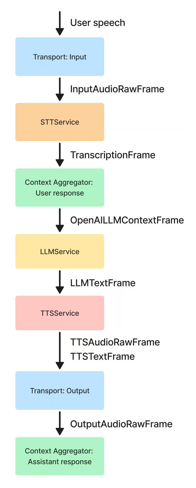

## 1. The Basic Flow of a Voice AI Agent

At a high level, a conversational voice agent processes human speech, generates a logical response, and speaks it back in real time.

### Core Pipeline Flow

```text
User Speaks (Audio) ──► STT (Speech-To-Text) ──► LLM (Language Model) ──► TTS (Text-To-Speech) ──► Agent Speaks (Audio)
```

### Core Challenges in Voice AI

| Challenge | Real-World Implication | Technical Requirement |
| :--- | :--- | :--- |
| **⚡ Latency** | Humans perceive delays > 500ms as unnatural and sluggish. | Must stream streaming audio/text frames end-to-end; traditional synchronous REST APIs are too slow. |
| **🗣️ Turn-Taking & Interruptions** | Knowing when a user has finished speaking vs pausing to think, or when a user interrupts the bot. | Requires ultra-fast local Voice Activity Detection (VAD) coupled with linguistic turn-analyzers. |
| **🧠 Context Management** | Keeping track of full conversation state as asynchronous audio and text frames stream in. | Dynamic Context Aggregators maintaining bidirectional prompt history in memory. |

---

## 2. Real-Time Processing with Pipecat & Frames

**Pipecat** is an open-source framework designed to construct ultra-low-latency, real-time streaming pipelines for multimodal AI agents.

### What are Frames?

Instead of waiting for a user to finish an entire sentence, process the text, and generate a full audio response (which introduces severe latency), data is sliced into lightweight **Frames**.

> **Definition**: **Frames** are discrete data packages that continuously flow upstream and downstream through the application pipeline.

```text
Microphone Audio ──► [ SPEECH Frame ] ──► STT ──► [ TEXT Frame ] ──► LLM ──► [ LLM RESPONSE Frame ] ──► TTS ──► [ SPEECH Frame ] ──► Speaker Playback
```

### Types of Frames

- 🎙️ **Audio Frames (`InputAudioRawFrame` / `SPEECH`)**: Raw binary PCM audio buffers captured from the user's microphone.
- 📝 **Text Frames (`TEXT`)**: Real-time transcribed text tokens streamed from the Speech-to-Text (STT) engine.
- 🤖 **LLM Response Frames (`LLM RESPONSE`)**: Generated response text chunk tokens streamed token-by-token from the language model.
- 🔊 **Synthesized Audio Frames (`SPEECH`)**: Sliced audio chunk buffers generated by the Text-to-Speech (TTS) engine for immediate playback.

### Why Use Frames?

- **Real-Time Streaming**: Enables zero-wait processing. As soon as the user says *"Hi"*, the first audio frame instantly traverses the pipeline.
- **Composable Decoupling**: Any service (STT, LLM, TTS) can be swapped out modularly without modifying surrounding logic.

### The Frame Processor Pipeline

Services act as **Frame Processors** that ingest one frame type and emit another:

```text
┌────────────────┐          ┌────────────────┐          ┌────────────────┐
│  Audio Frames  │ ──► STT ─┼►  Text Frames  │ ──► LLM ─┼► LLM Text Frame│ ──► TTS ──► Synthesized Audio
└────────────────┘          └────────────────┘          └────────────────┘
```

---

## 3. The Pipeline Architecture

In Pipecat, a conversational voice pipeline is constructed as an ordered linear sequence of processors:

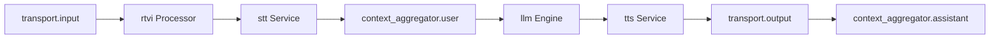

### Standard Pipeline Execution Order

1. **`transport.input()`**: Ingests raw incoming user audio streams from WebRTC/WebSocket transports (upstream).
2. **`rtvi`**: The Real-Time Voice Interface processor converts raw audio into `InputAudioRawFrame` and handles custom client-side event triggers.
3. **`stt`**: Plug-and-play Speech-to-Text service (e.g., Deepgram, ElevenLabs, Cartesia, Whisper).
4. **`context_aggregator.user()`**: Intercepts transcribed user text and appends it to the LLM's conversation history array.
5. **`llm`**: Language model engine that generates streaming response text tokens based on conversation context.
6. **`tts`**: Text-to-Speech service that synthesizes the LLM's text tokens into streaming audio chunks.
7. **`transport.output()`**: Dispatches the synthesized bot audio frames back to the client speaker (downstream).
8. **`context_aggregator.assistant()`**: Captures the bot's synthesized verbal response and appends it to the running conversation history.

### Context Aggregator & State Management

The **Context Aggregator** automatically maintains conversational state and prompt history for the LLM across turns:

```json
[
  { "role": "user", "content": "hi" },
  { "role": "assistant", "content": "hi, bro" }
]
```

---

## 4. Advanced Turn-Taking (VAD + TurnAnalyser)

Turn-taking uses an intelligent **two-stage detection architecture** to distinguish between a user finishing their sentence versus pausing briefly to think:

```text
User Speech
    │
    ▼
┌────────────────────────────────────────────────────────┐
│ Stage 1: VAD (Voice Activity Detection)                │
│  - Ultra-fast local execution (~1ms latency)           │
│  - Detects speech vs silence                           │
│  - Triggers on short pause threshold (e.g. stop = 0.2s)│
└───────────────────────────┬────────────────────────────┘
                            │ (Silence detected)
                            ▼
┌────────────────────────────────────────────────────────┐
│ Stage 2: TurnAnalyser (ML Model)                       │
│  - Evaluates last 8-9s of audio for linguistic cues    │
│  - Analyzes intonation, syntax, and phrasing           │
└───────────────┬────────────────────────┬───────────────┘
                │                        │
       [ Thought Complete ]     [ Thought Incomplete ]
                │                        │
                ▼                        ▼
        Voice Agent Speaks      Wait for User (up to 3s)
                                (If still silent -> Agent speaks)
```

### VAD (Voice Activity Detection)
- **Role**: High-speed binary classifier detecting speech vs silence.
- **Speed**: Runs locally with near-zero latency (~1ms).
- **Trigger**: Activates when a short silence window is hit (`stop_secs = 0.2s`).
- **Action**: Passes audio buffer to `TurnAnalyser` for deeper semantic evaluation.

### TurnAnalyser Machine Learning Model
- **Role**: Determines whether the user's semantic thought is complete.
- **Mechanism**: Analyzes the trailing ~8 to 9 seconds of audio using linguistic patterns, pitch intonation, and syntax boundaries.
- **Outcomes**:
  - **Complete Thought**: Voice Agent immediately yields turn and begins speaking.
  - **Incomplete Thought**: System holds silence and waits for user to continue speaking (up to a 3-second safety window). If silence continues past 3 seconds, the agent assumes the turn is yielded.

---

## 5. Transport & Networking: WebRTC vs WebSocket

The transport layer strictly manages the Input/Output (I/O) of raw media streams and data packets between client devices and the voice server.

### Protocol Comparison Matrix

| Feature | 🔌 WebSocket | ⚡ WebRTC |
| :--- | :--- | :--- |
| **Protocol Foundation** | **TCP** (Guaranteed, ordered delivery) | **UDP** (Optimized for maximum speed, tolerates packet loss) |
| **Communication Model** | Client-to-Server | Peer-to-Peer / Client-to-Server (SFU/MCU) |
| **Supported Data Types** | Text, JSON, Binary | Raw Audio Streams, Video Tracks, Binary Data Channels |
| **Latency Profile** | Low, but subject to TCP head-of-line blocking delays | **Ultra-low (Sub-100ms)**; purpose-built for real-time media |
| **Optimal Use Cases** | Chat applications, notifications, live tickers | **Voice/Video calls, live streaming, Real-Time Voice AI** |

### Implementation Notes

> 💡 **Audio Channel (UDP)**: WebRTC is utilized for high-throughput, low-latency audio streaming.  
> 💡 **Data Channel**: WebRTC Data Channels are utilized concurrently alongside the media track to handle custom client-server telemetry and control events.

---

## 6. RTVI (Real-Time Voice Interface) & Pipeline Runner

**RTVI** serves as the universal standardization bridge connecting client applications (web, iOS, Android) to the backend voice pipeline.

```text
┌─────────────────────────────────────────────────────────────┐
│                        PipelineTask                         │
│                                                             │
│   ┌─────────────────────────────────────────────────────┐   │
│   │                 Conversational Pipeline             │   │
│   │                                                     │   │
│   │  transport.in ──► [ RTVI Processor ] ──► STT ──►... │   │
│   └──────────────────────────┬──────────────────────────┘   │
│                              │                              │
│                              ▼                              │
│                     [ RTVI Observer ]                       │
│             (Tracks state & broadcasts metrics)             │
└──────────────────────────────┬──────────────────────────────┘
                               │ (WebRTC Data Channel)
                               ▼
                        Client Frontend
```

### RTVI Processor vs RTVI Observer

| Component | Position | Responsibilities |
| :--- | :--- | :--- |
| **`RTVIProcessor`** | **Inline** (Inside the pipeline) | • Converts incoming raw audio into `InputAudioRawFrame`.<br>• Injects custom client actions & control events into the pipeline. |
| **`RTVIObserver`** | **Parallel** (Inside `PipelineTask`) | • Observes pipeline structural state transitions.<br>• Broadcasts telemetry, transcript events, and latency metrics via Data Channel. |

### Pipeline Task & Pipeline Runner

- **`PipelineTask`**: Encapsulates the core pipeline flow, linking the `RTVIObserver` with task configuration settings (metrics, event listeners, timeouts).
- **`PipelineRunner`**: The async execution engine (e.g. `run_bot()`). It orchestrates task lifecycles, manages asynchronous event loops, handles thread concurrency, and ensures graceful teardown and resource cleanup when connections terminate.


Searched web: "site:docs.pipecat.ai pipeline frames processors vad function calling"
Searched web: "site:docs.pipecat.ai/guides OR site:docs.pipecat.ai/getting-started OR site:docs.pipecat.ai/services"

Here are the specific, direct documentation and repository links categorized by what is **currently used in your project** and what will be **useful for future scaling**.

---

### 📌 1. Specific Links for Components Used in Your Project

| Component in `bot.py` | Direct Documentation / Code Link |
| :--- | :--- |
| **Pipeline & Frame Processors** | [Pipecat Core Concepts: Pipelines & Processors](https://docs.pipecat.ai/pipecat/learn/pipeline) |
| **Custom Processors (`FrameProcessor`)** | [Building Custom Processors Guide](https://docs.pipecat.ai/pipecat/fundamentals/custom-frame-processor) |
| **Frames Reference (`pipecat.frames`)** | [Pipecat Frames Source Code & Reference](https://github.com/pipecat-ai/pipecat/blob/main/src/pipecat/frames/frames.py) |
| **LLM Function Calling & Tools** | [Pipecat Function Calling / Tools Guide](https://docs.pipecat.ai/pipecat/learn/function-calling) |
| **VAD & Smart Turn Detection** | [Turn Detection & Silero VAD Guide](https://docs.pipecat.ai/pipecat/learn/speech-input) |
| **RTVI Client Protocol** | [RTVI Setup & Protocol Specification](https://docs.pipecat.ai/client/rtvi-standard) |
| **Deepgram STT Integration** | [Deepgram STT Service Documentation](https://docs.pipecat.ai/pipecat/learn/speech-to-text) |
| **Groq LLM Integration** | [Groq LLM Service Documentation](https://docs.pipecat.ai/pipecat/learn/llm) |
| **ElevenLabs TTS Integration** | [ElevenLabs TTS Service Documentation](https://docs.pipecat.ai/pipecat/learn/text-to-speech) |
| **FastAPI WebSocket Transport** | [FastAPI WebSocket Transport Reference](https://docs.pipecat.ai/pipecat/learn/transports) |

---

### 🚀 2. Specific Links for Future Capabilities

| Future Feature | Direct Link |
| :--- | :--- |
| **User Interruption & Audio Cancellation** | [Handling User Interruptions & Barge-in](https://docs.pipecat.ai/pipecat/fundamentals/interruptions) |
| **Latency Metrics & Observability (TTFB)** | [Pipeline Metrics and Usage Tracking](https://docs.pipecat.ai/pipecat/fundamentals/metrics) |
| **Audio Recording (`WaveFileRecorder`)** | [Audio Recording Processors](https://github.com/pipecat-ai/pipecat/blob/main/src/pipecat/processors/audio/audio_buffer_processor.py) |
| **Telephony Integration (Twilio / SIP)** | [Telephony & WebRTC Transports](https://docs.pipecat.ai/pipecat/telephony/overview) |
| **Noise Suppression Filters (RNNoise / Krisp)** | [Audio Filters & Noise Reduction](https://docs.pipecat.ai/pipecat/features/krisp-viva) |
| **Official Working Examples** | [Pipecat GitHub Examples Directory](https://github.com/pipecat-ai/pipecat/tree/main/examples) |
| **RTVI Frontend Client Library (JS/React)** | [RTVI Client JavaScript/TypeScript Repo](https://github.com/rtvi-ai/rtvi-client-js) |

---


---

## 🧬 Pipecat Architecture, Diagrams & Fundamental Concepts Deep Dive

This section provides visual diagrams, code blueprints, and communication channel breakdowns for Pipecat's real-time voice orchestration engine based on fundamental core concepts.

---

### 1. 🧩 The 5 Fundamental Concepts of Pipecat

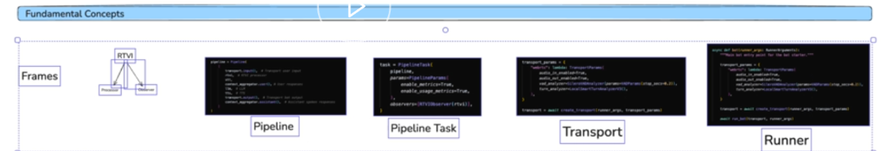

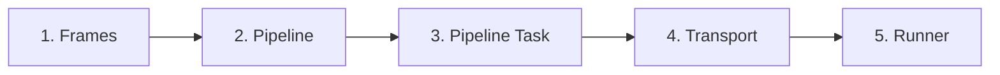

* **1. Frames**: The fundamental data units (Audio, Text, Control Signals, Metrics) flowing asynchronously through the system.
* **2. Pipeline**: An ordered list of frame processors through which frames flow sequentially.
* **3. Pipeline Task**: The runtime execution container binding the pipeline with execution parameters (`PipelineParams`) and observers (`RTVIObserver`).
* **4. Transport**: The network abstraction layer (e.g. WebSockets, WebRTC) handling audio I/O, VAD (Voice Activity Detection), and turn detection.
* **5. Runner**: The main entry point function initiating the transport and running the bot event loop via `run_bot(transport, runner_args)`.

---

### 2. ⚡ Frame Processor Data Flow

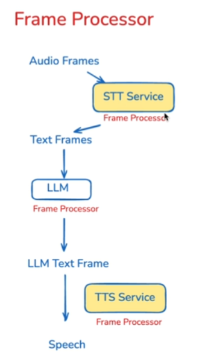

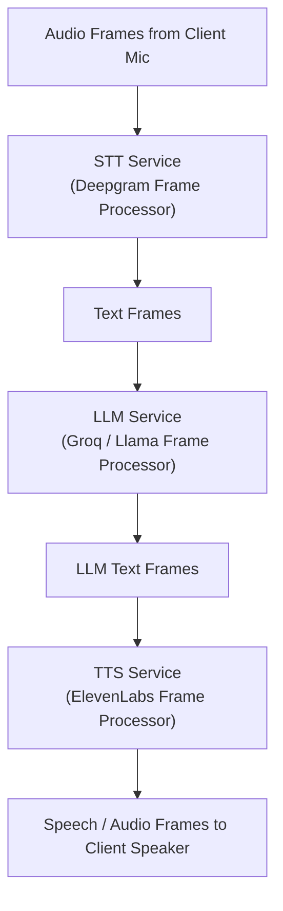

**Key Stages**:
1. **Audio Frames -> STT Service**: Ingests raw audio chunks from client microphone and streams text transcripts.
2. **Text Frames -> LLM Service**: Transcripts are injected into prompt context to stream LLM token responses.
3. **LLM Text Frames -> TTS Service**: Token stream is synthesized into high-fidelity audio chunks.
4. **Speech Output**: Synthesized audio frames flow to the transport output to play through client speakers.

---

### 3. 🔗 Pipeline Processor Chain Definition

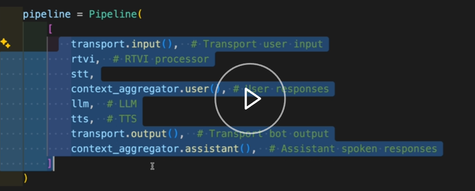

```python
pipeline = Pipeline([
    transport.input(),              # 1. Transport User Input (Microphone Audio)
    rtvi,                          # 2. RTVI Protocol Processor
    stt,                           # 3. Speech-to-Text Transcription (Deepgram)
    context_aggregator.user(),     # 4. Ingest User Transcript into Context
    llm,                           # 5. LLM Inference & Streaming (Groq)
    tts,                           # 6. Text-to-Speech Synthesis (ElevenLabs)
    transport.output(),            # 7. Transport Bot Output (Speaker Audio)
    context_aggregator.assistant() # 8. Ingest Assistant Spoken Response into Context
])
```

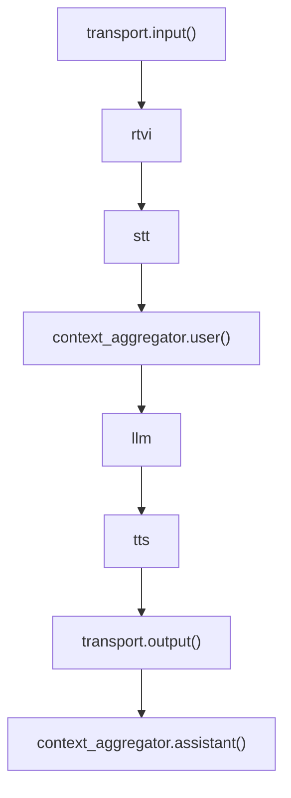

---

### 4. 📦 Pipeline vs. Pipeline Task Execution Container

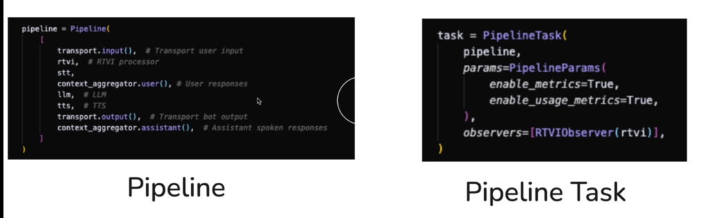

```python
# 1. Pipeline Definition: The ordered chain of processors
pipeline = Pipeline([ ... ])

# 2. PipelineTask: The active execution wrapper
task = PipelineTask(
    pipeline,
    params=PipelineParams(
        enable_metrics=True,
        enable_usage_metrics=True,
    ),
    observers=["RTVIObserver(rtvi)"],
)
```

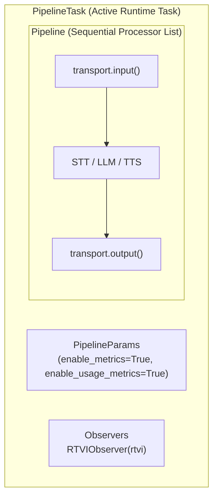

---

### 5. 📡 Client <---> Pipeline Task Communication Channels

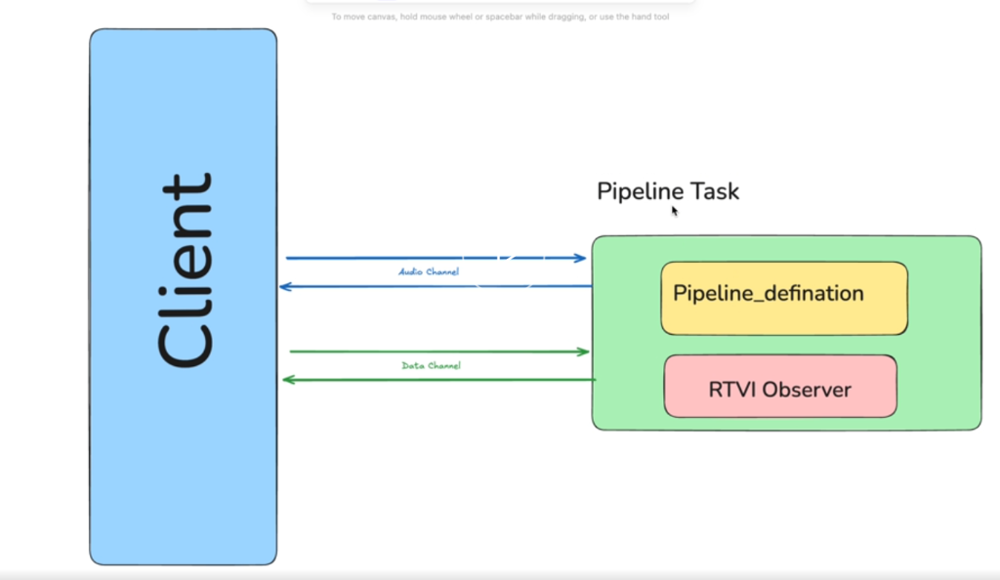

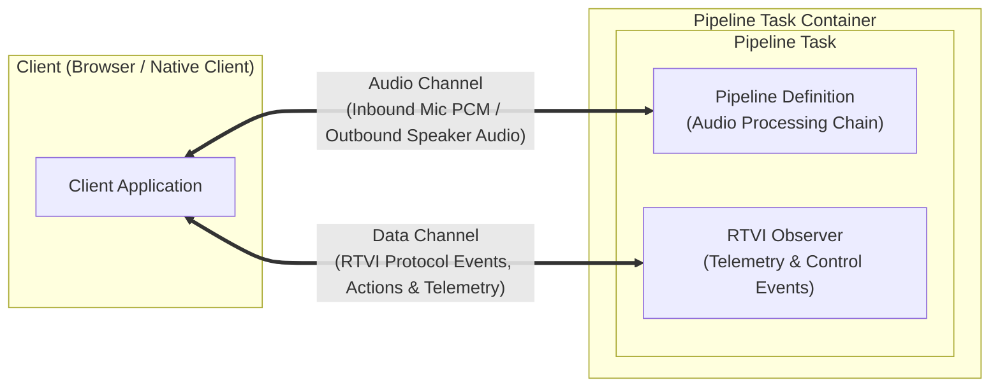

* **Audio Channel**: Handles full-duplex bi-directional audio streaming (PCM input from microphone <-> synthesized audio output to speakers).
* **Data Channel**: Transmits real-time control signals, barge-in interruptions, volume metrics, custom action dispatches, and client state updates via RTVI protocol.


---

## 🌐 WebSocket, Load Balancers & Dynamic URL Resolution Explained

### 1. What is WebSocket?
**WebSocket (`RFC 6455`)** is a persistent, bidirectional, full-duplex communication protocol operating over a single TCP connection.
- **Traditional HTTP**: Client sends a request $\rightarrow$ Server sends a response $\rightarrow$ Connection closes/idles (Half-Duplex / Pull-based).
- **WebSocket**: Client & Server establish an open pipe $\rightarrow$ Both can simultaneously send and receive messages at any microsecond without waiting for requests (Full-Duplex / Push-based).

```text
HTTP Request-Response (High Overhead):
Client  ───────────────── Request (1KB Headers) ─────────────────► Server
Client  ◄──────────────── Response (Status + Body) ────────────── Server
(Connection closed or kept-alive idle)

WebSocket Full-Duplex Stream (Near-Zero Overhead):
Client  ═════════════════ 101 Switching Protocols ═══════════════ Server
Client  ◄═══════════════ [Real-Time Audio Frame] ═══════════════► Server
Client  ◄═══════════════ [RTVI Text Transcript]  ═══════════════► Server
Client  ◄═══════════════ [TTS Audio Chunks]      ═══════════════► Server
```

---

### 2. Why is WebSocket Needed for Real-Time Voice AI?
A conversational AI assistant requires real-time streaming:
1. **Continuous Audio Ingestion**: The user’s microphone streams continuous raw PCM audio frames (every 20ms to 100ms). HTTP polling cannot handle this throughput without extreme latency and server strain.
2. **Instant Audio Output**: ElevenLabs / TTS produces audio chunks that must be played immediately as they arrive, not buffered in a single giant HTTP response.
3. **Low Latency & Low Overhead**: HTTP requests send 500B–2KB of headers with every transmission. WebSocket frames only have a **2 to 10-byte header**, saving bandwidth and avoiding TCP handshake overhead.
4. **Instant Interruption (Barge-in)**: If the user interrupts while the AI is speaking, the client sends an instant control signal through the open socket to cancel TTS playback immediately.

---

### 3. How WebSocket Works (The Lifecycle)
1. **HTTP Handshake & Upgrade**:
   - Client sends standard HTTP request:
     ```http
     GET /api/v1/stream/ws/123 HTTP/1.1
     Host: api.example.com
     Upgrade: websocket
     Connection: Upgrade
     Sec-WebSocket-Key: dGhlIHNhbXBsZSBub25jZQ==
     Sec-WebSocket-Version: 13
     ```
2. **Server Upgrade Response (`101 Switching Protocols`)**:
   - Server responds with HTTP `101 Switching Protocols`. The TCP socket switches from HTTP to raw WebSocket frames.
3. **Data Framing & Streaming**:
   - Audio and RTVI control messages travel as Protobuf/Binary or JSON frames over the same socket.
4. **Heartbeats & Teardown**:
   - Periodic Ping/Pong frames detect connection loss. Closing the socket cleans up the Pipecat pipeline cleanly.

---

### 4. What is a Load Balancer & Reverse Proxy (ALB / Nginx)?
In production, backend applications rarely talk directly to the internet. Instead, they sit behind:
- **Load Balancers (e.g., AWS ALB, GCP Load Balancer)**: Distribute traffic across multiple server instances/containers, handle autoscaling, and perform health checks.
- **Reverse Proxies (e.g., Nginx, Traefik, Cloudflare)**: Manage SSL/TLS certificates, rate limiting, and domain routing.

#### ⚠️ The SSL Termination & Host Masking Problem:
1. **Client $\rightarrow$ Load Balancer**: Uses public domain and encryption (`https://api.yourdomain.com` or `wss://`).
2. **Load Balancer $\rightarrow$ Backend Container**: The Load Balancer terminates SSL and forwards raw traffic over private HTTP (`http://10.0.0.15:8000`).
3. **The Trap**: If your backend asks FastAPI `request.url.scheme` and `request.url.netloc`, FastAPI sees `http` and internal IP `10.0.0.15:8000`. If you send this back to the frontend, the browser tries to connect to an unreachable internal IP and gets blocked by Mixed Content security policies!

To solve this, Load Balancers inject forward headers:
- **`X-Forwarded-Proto`**: Contains the original protocol used by the client (`https` or `http`).
- **`X-Forwarded-Host`**: Contains the original public domain or host requested by the client (`api.yourdomain.com`).

---

### 5. Detailed Breakdown of the `stream.py` Code Snippet

```python
# Scheme & Host resolution for ALB / Reverse Proxy setups
forwarded_proto = request.headers.get("X-Forwarded-Proto", request.url.scheme)
forwarded_host = request.headers.get("X-Forwarded-Host", request.url.netloc)

ws_scheme = "wss" if forwarded_proto == "https" else "ws"
ws_url = f"{ws_scheme}://{forwarded_host}/api/v1/stream/ws/{payload.equipment_id}"

logger.info(f"Generated WebSocket URL: {ws_url}")

return {"ws_url": ws_url}
```

#### Line-by-Line Technical Analysis:

| Code Line | What It Does & Why It Is Essential |
| :--- | :--- |
| `forwarded_proto = request.headers.get("X-Forwarded-Proto", request.url.scheme)` | **Extracts Protocol**: Checks if an ALB/Nginx proxy sent `X-Forwarded-Proto` (e.g. `"https"`). If running locally without a proxy, falls back to `request.url.scheme` (`"http"`). |
| `forwarded_host = request.headers.get("X-Forwarded-Host", request.url.netloc)` | **Extracts Public Domain**: Retrieves the public host (e.g., `"api.voicebot.com"` or `"localhost:8000"`). Avoids leaking internal container IPs like `10.0.x.x` or `172.17.x.x`. |
| `ws_scheme = "wss" if forwarded_proto == "https" else "ws"` | **Determines Secure vs Insecure WebSocket**: If public traffic is `https`, generates encrypted `wss://` (WebSocket Secure / TLS). If public traffic is `http`, generates `ws://`. |
| `ws_url = f"{ws_scheme}://{forwarded_host}/api/v1/stream/ws/{payload.equipment_id}"` | **Constructs Full Dynamic WS Endpoint**: Dynamically builds the exact WebSocket URL tied to the validated `equipment_id`. |
| `return {"ws_url": ws_url}` | **Delivers Handshake Payload**: Returns the connection URL to the frontend so the client can immediately open the WebSocket stream. |


---


## 🧭 Recommended Reading & Study Roadmap ("Watch Order")

If you are reviewing this codebase for technical interviews, architecture audits, or deployment, follow this recommended sequence to understand the system from high-level architecture down to low-level implementation code:

```mermaid
graph LR
    Step1["1. System Overview"] --> Step2["2. Interview Prep Guide"]
    Step2 --> Step3["3. Database & Vector Models"]
    Step3 --> Step4["4. WebSocket Protocol Flow"]
    Step4 --> Step5["5. AWS VPC Architecture"]
    Step5 --> Step6["6. AWS ECS Deployment"]
    Step6 --> Step7["7. Free-Tier Demo Setup"]
    Step7 --> Step8["8. Developer Blueprints"]
    Step8 --> Step9["9. System Roadmap"]
```

| Order | Document / Guide | Primary Learning Focus | Associated Source Code Files |
| :---: | :--- | :--- | :--- |
| **01** | **[`README.md`](readme.md)** | System overview, core voice pipeline flow, Pipecat frame architecture, and turn-taking concepts. | [`backend/app/bot.py`](backend/app/bot.py)<br>[`frontend/src/App.tsx`](frontend/src/App.tsx) |
| **02** | **[`docs/INTERVIEW_PREPARATION_GUIDE.md`](docs/INTERVIEW_PREPARATION_GUIDE.md)** | Master interview defense guide for Shivansh Vyas: 8 real-life analogies, sub-800ms SLA, and technical Q&As. | [`backend/app/bot.py`](backend/app/bot.py)<br>[`backend/app/services/rag.py`](backend/app/services/rag.py) |
| **03** | **[`docs/DATABASE_SCHEMA_AND_MODELS.md`](docs/DATABASE_SCHEMA_AND_MODELS.md)** | MongoDB Atlas `$vectorSearch` HNSW indexes, Pydantic v2 models, BSON ObjectIds, and multi-tenant security. | [`backend/app/database.py`](backend/app/database.py)<br>[`backend/app/models/rag.py`](backend/app/models/rag.py)<br>[`backend/app/models/equipment.py`](backend/app/models/equipment.py) |
| **04** | **[`docs/websocket_flow.md`](docs/websocket_flow.md)** | Web Audio API PCM 16kHz audio capture, RTVI protocol JSON frames, and WebSocket connection lifecycle. | [`backend/app/routers/stream.py`](backend/app/routers/stream.py)<br>[`frontend/src/hooks/pipecat-chat-events.ts`](frontend/src/hooks/pipecat-chat-events.ts) |
| **05** | **[`docs/AWS_VPC_ARCHITECTURE_EXPLANATION.md`](docs/AWS_VPC_ARCHITECTURE_EXPLANATION.md)** | Enterprise AWS Cloud VPC topology, Public/Private subnets, ALB path routing rules, and NAT Gateway egress. | [`infrastructure/cloudformation.yaml`](infrastructure/cloudformation.yaml)<br>[`infrastructure/setup-aws.sh`](infrastructure/setup-aws.sh) |
| **06** | **[`docs/deployment.md`](docs/deployment.md)** | Step-by-step production AWS deployment guide: Secrets Manager, Docker ECR builds, Fargate tasks, and CI/CD. | [`scripts/build-and-push-ecr.sh`](scripts/build-and-push-ecr.sh)<br>[`scripts/create-services.sh`](scripts/create-services.sh)<br>[`.github/workflows/deploy.yml`](.github/workflows/deploy.yml) |
| **07** | **[`docs/FREE_TIER_DEPLOYMENT_GUIDE.md`](docs/FREE_TIER_DEPLOYMENT_GUIDE.md)** | Zero-cost live demo deployment guide: Vercel (Frontend SPA) + Render/Koyeb (FastAPI Backend) + Atlas M0. | [`backend/app/config.py`](backend/app/config.py)<br>[`frontend/src/components/RealTimeChatPanel.tsx`](frontend/src/components/RealTimeChatPanel.tsx) |
| **08** | **[`docs/notes.md`](docs/notes.md)** | Deep developer specifications, Pipecat frame processor blueprints, and copy-paste code snippets. | [`backend/app/services/text_extraction.py`](backend/app/services/text_extraction.py)<br>[`backend/app/routers/equipment.py`](backend/app/routers/equipment.py) |
| **09** | **[`docs/FUTURE_UPDATES.md`](docs/FUTURE_UPDATES.md)** | System enhancements roadmap: Multi-Modal Vision RAG, offline edge container deployment, and hybrid search (RRF). | [`backend/app/services/rag.py`](backend/app/services/rag.py) |

---
## 📁 Project Documentation & Engineering Guides (docs/)

All core architectural specifications, database schemas, deployment guides, developer notes, and interview preparation materials are organized inside the [docs/](docs/) directory:

| Guide / Specification | Description | Direct Link |
| :--- | :--- | :--- |
| **Interview Preparation Guide** | Complete technical & HR interview defense guide, 8 real-life analogies, Q&As, and revision sheet by Shivansh Vyas | [docs/INTERVIEW_PREPARATION_GUIDE.md](docs/INTERVIEW_PREPARATION_GUIDE.md) |
| **Free-Tier Deployment Guide** | Step-by-step 100% free production deployment covering Vercel, Render / Koyeb, and MongoDB Atlas M0 | [docs/FREE_TIER_DEPLOYMENT_GUIDE.md](docs/FREE_TIER_DEPLOYMENT_GUIDE.md) |
| **AWS Cloud VPC Architecture** | Technical breakdown of production AWS Cloud VPC, Public/Private subnets, ALB ingress, and NAT Gateway egress | [docs/AWS_VPC_ARCHITECTURE_EXPLANATION.md](docs/AWS_VPC_ARCHITECTURE_EXPLANATION.md) |
| **Database Schema & Vector Models** | MongoDB Atlas schema specs,  indexes, Pydantic v2 domain models, and multi-tenant rules | [docs/DATABASE_SCHEMA_AND_MODELS.md](docs/DATABASE_SCHEMA_AND_MODELS.md) |
| **AWS ECS Production Deployment** | AWS production deployment guide covering ECS Fargate, CloudFormation IaC, ECR push scripts, and CI/CD | [docs/deployment.md](docs/deployment.md) |
| **Developer Notes & Specifications** | Comprehensive developer progress notes, Pipecat framework concepts, and copy-paste blueprints | [docs/notes.md](docs/notes.md) |
| **Future System Roadmap** | Project roadmap detailing multi-modal vision RAG, offline edge deployment, and hybrid BM25 + Vector Search | [docs/FUTURE_UPDATES.md](docs/FUTURE_UPDATES.md) |
| **WebSocket Protocol Flow** | Handshake lifecycle, binary frame formats, and RTVI protocol events | [docs/websocket_flow.md](docs/websocket_flow.md) |

---

## ☁️ 7. AWS Production Cloud Infrastructure & Deployment

Developer: **Shivansh Vyas** (Shivanshvyas1729)

This application is fully automated for production on **AWS Cloud** using **ECS Fargate**, **Application Load Balancer (ALB)**, **Secrets Manager**, and **CloudFormation (IaC)**.

### AWS Cloud Architecture Diagram


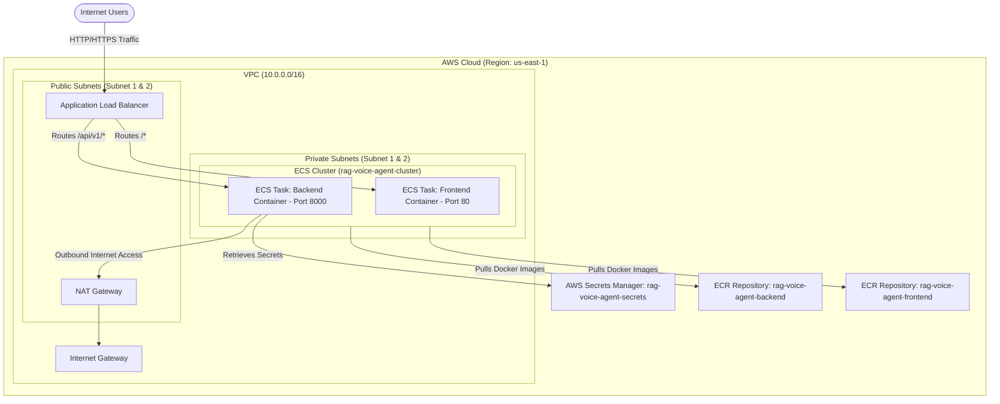

### Key Services Used

| Service | Purpose |
| :--- | :--- |
| **AWS CloudFormation** | Infrastructure-as-Code (IaC) provisioning VPC, ALB, ECR, ECS Cluster |
| **AWS ECS Fargate** | Serverless container orchestration for Backend & Frontend |
| **AWS Secrets Manager** | Secure storage for API keys (MONGO_URL, DEEPGRAM_API_KEY, GROQ_API_KEY, AICREDITS_API_KEY, ELEVENLABS_API_KEY) |
| **AWS Application Load Balancer (ALB)** | Public HTTP/WebSocket traffic routing & SSL termination |
| **Amazon ECR** | Docker container image registry |
| **GitHub Actions** | Automated CI/CD pipeline (.github/workflows/deploy.yml) |

### Quick Deployment Commands

1. **Deploy Infrastructure & Secrets:**
   ```bash
   cd infrastructure
   chmod +x setup-aws.sh destroy-aws.sh
   ./setup-aws.sh
   `

2. **Build & Push Containers to ECR:**
   ```bash
   cd ../scripts
   chmod +x build-and-push-ecr.sh create-services.sh deploy_aws.sh
   ./build-and-push-ecr.sh
   `

3. **Register Tasks & Launch ECS Services:**
   ```bash
   aws ecs register-task-definition --cli-input-json file://../.github/workflows/task-definition-backend.json --region us-east-1
   aws ecs register-task-definition --cli-input-json file://../.github/workflows/task-definition-frontend.json --region us-east-1
   ./create-services.sh
   `

4. **Teardown Infrastructure (Stop Charges):**
   ```bash
   cd ../infrastructure
   ./destroy-aws.sh
   `
