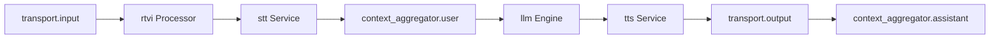

# 🎙️ Voice AI Agent Architecture & Engineering Guide

[](https://pipecat.ai/)
[](https://webrtc.org/)
[](https://github.com/pipecat-ai/pipecat)
[](https://www.python.org/)

> **System Overview**: High-performance, low-latency streaming pipeline architecture for conversational Voice AI agents built with **Pipecat**, **WebRTC**, frame processors, and real-time turn-taking models.

---

## 📌 Table of Contents

1. [🎙️ 1. The Basic Flow of a Voice AI Agent](#1-the-basic-flow-of-a-voice-ai-agent)
   - [Core Pipeline Flow](#core-pipeline-flow)
   - [Core Challenges in Voice AI](#core-challenges-in-voice-ai)
2. [⚡ 2. Real-Time Processing with Pipecat & Frames](#2-real-time-processing-with-pipecat--frames)
   - [What are Frames?](#what-are-frames)
   - [Types of Frames](#types-of-frames)
   - [Why Use Frames?](#why-use-frames)
   - [The Frame Processor Pipeline](#the-frame-processor-pipeline)
3. [🏗️ 3. The Pipeline Architecture](#3-the-pipeline-architecture)
   - [Standard Pipeline Execution Order](#standard-pipeline-execution-order)
   - [Context Aggregator & State Management](#context-aggregator--state-management)
4. [🧠 4. Advanced Turn-Taking (VAD + TurnAnalyser)](#4-advanced-turn-taking-vad--turnanalyser)
   - [Two-Stage Turn-Taking Architecture](#two-stage-turn-taking-architecture)
   - [VAD (Voice Activity Detection)](#vad-voice-activity-detection)
   - [TurnAnalyser Machine Learning Model](#turnanalyser-machine-learning-model)
5. [🌐 5. Transport & Networking: WebRTC vs WebSocket](#5-transport--networking-webrtc-vs-websocket)
   - [Protocol Comparison Matrix](#protocol-comparison-matrix)
   - [Implementation Notes](#implementation-notes)
6. [🔌 6. RTVI (Real-Time Voice Interface) & Pipeline Runner](#6-rtvi-real-time-voice-interface--pipeline-runner)
   - [RTVI Processor vs RTVI Observer](#rtvi-processor-vs-rtvi-observer)
   - [Pipeline Task & Pipeline Runner](#pipeline-task--pipeline-runner)

---

## 1. The Basic Flow of a Voice AI Agent

At a high level, a conversational voice agent processes human speech, generates a logical response, and speaks it back in real time.

### Core Pipeline Flow

```text
User Speaks (Audio) ──► STT (Speech-To-Text) ──► LLM (Language Model) ──► TTS (Text-To-Speech) ──► Agent Speaks (Audio)
```

### Core Challenges in Voice AI

| Challenge | Real-World Implication | Technical Requirement |
| :--- | :--- | :--- |
| **⚡ Latency** | Humans perceive delays > 500ms as unnatural and sluggish. | Must stream streaming audio/text frames end-to-end; traditional synchronous REST APIs are too slow. |
| **🗣️ Turn-Taking & Interruptions** | Knowing when a user has finished speaking vs pausing to think, or when a user interrupts the bot. | Requires ultra-fast local Voice Activity Detection (VAD) coupled with linguistic turn-analyzers. |
| **🧠 Context Management** | Keeping track of full conversation state as asynchronous audio and text frames stream in. | Dynamic Context Aggregators maintaining bidirectional prompt history in memory. |

---

## 2. Real-Time Processing with Pipecat & Frames

**Pipecat** is an open-source framework designed to construct ultra-low-latency, real-time streaming pipelines for multimodal AI agents.

### What are Frames?

Instead of waiting for a user to finish an entire sentence, process the text, and generate a full audio response (which introduces severe latency), data is sliced into lightweight **Frames**.

> **Definition**: **Frames** are discrete data packages that continuously flow upstream and downstream through the application pipeline.

```text
Microphone Audio ──► [ SPEECH Frame ] ──► STT ──► [ TEXT Frame ] ──► LLM ──► [ LLM RESPONSE Frame ] ──► TTS ──► [ SPEECH Frame ] ──► Speaker Playback
```

### Types of Frames

- 🎙️ **Audio Frames (`InputAudioRawFrame` / `SPEECH`)**: Raw binary PCM audio buffers captured from the user's microphone.
- 📝 **Text Frames (`TEXT`)**: Real-time transcribed text tokens streamed from the Speech-to-Text (STT) engine.
- 🤖 **LLM Response Frames (`LLM RESPONSE`)**: Generated response text chunk tokens streamed token-by-token from the language model.
- 🔊 **Synthesized Audio Frames (`SPEECH`)**: Sliced audio chunk buffers generated by the Text-to-Speech (TTS) engine for immediate playback.

### Why Use Frames?

- **Real-Time Streaming**: Enables zero-wait processing. As soon as the user says *"Hi"*, the first audio frame instantly traverses the pipeline.
- **Composable Decoupling**: Any service (STT, LLM, TTS) can be swapped out modularly without modifying surrounding logic.

### The Frame Processor Pipeline

Services act as **Frame Processors** that ingest one frame type and emit another:

```text
┌────────────────┐          ┌────────────────┐          ┌────────────────┐
│  Audio Frames  │ ──► STT ─┼►  Text Frames  │ ──► LLM ─┼► LLM Text Frame│ ──► TTS ──► Synthesized Audio
└────────────────┘          └────────────────┘          └────────────────┘
```

---

## 3. The Pipeline Architecture

In Pipecat, a conversational voice pipeline is constructed as an ordered linear sequence of processors:



### Standard Pipeline Execution Order

1. **`transport.input()`**: Ingests raw incoming user audio streams from WebRTC/WebSocket transports (upstream).
2. **`rtvi`**: The Real-Time Voice Interface processor converts raw audio into `InputAudioRawFrame` and handles custom client-side event triggers.
3. **`stt`**: Plug-and-play Speech-to-Text service (e.g., Deepgram, ElevenLabs, Cartesia, Whisper).
4. **`context_aggregator.user()`**: Intercepts transcribed user text and appends it to the LLM's conversation history array.
5. **`llm`**: Language model engine that generates streaming response text tokens based on conversation context.
6. **`tts`**: Text-to-Speech service that synthesizes the LLM's text tokens into streaming audio chunks.
7. **`transport.output()`**: Dispatches the synthesized bot audio frames back to the client speaker (downstream).
8. **`context_aggregator.assistant()`**: Captures the bot's synthesized verbal response and appends it to the running conversation history.

### Context Aggregator & State Management

The **Context Aggregator** automatically maintains conversational state and prompt history for the LLM across turns:

```json
[
  { "role": "user", "content": "hi" },
  { "role": "assistant", "content": "hi, bro" }
]
```

---

## 4. Advanced Turn-Taking (VAD + TurnAnalyser)

Turn-taking uses an intelligent **two-stage detection architecture** to distinguish between a user finishing their sentence versus pausing briefly to think:

```text
User Speech
    │
    ▼
┌────────────────────────────────────────────────────────┐
│ Stage 1: VAD (Voice Activity Detection)                │
│  - Ultra-fast local execution (~1ms latency)           │
│  - Detects speech vs silence                           │
│  - Triggers on short pause threshold (e.g. stop = 0.2s)│
└───────────────────────────┬────────────────────────────┘
                            │ (Silence detected)
                            ▼
┌────────────────────────────────────────────────────────┐
│ Stage 2: TurnAnalyser (ML Model)                       │
│  - Evaluates last 8-9s of audio for linguistic cues    │
│  - Analyzes intonation, syntax, and phrasing           │
└───────────────┬────────────────────────┬───────────────┘
                │                        │
       [ Thought Complete ]     [ Thought Incomplete ]
                │                        │
                ▼                        ▼
        Voice Agent Speaks      Wait for User (up to 3s)
                                (If still silent -> Agent speaks)
```

### VAD (Voice Activity Detection)
- **Role**: High-speed binary classifier detecting speech vs silence.
- **Speed**: Runs locally with near-zero latency (~1ms).
- **Trigger**: Activates when a short silence window is hit (`stop_secs = 0.2s`).
- **Action**: Passes audio buffer to `TurnAnalyser` for deeper semantic evaluation.

### TurnAnalyser Machine Learning Model
- **Role**: Determines whether the user's semantic thought is complete.
- **Mechanism**: Analyzes the trailing ~8 to 9 seconds of audio using linguistic patterns, pitch intonation, and syntax boundaries.
- **Outcomes**:
  - **Complete Thought**: Voice Agent immediately yields turn and begins speaking.
  - **Incomplete Thought**: System holds silence and waits for user to continue speaking (up to a 3-second safety window). If silence continues past 3 seconds, the agent assumes the turn is yielded.

---

## 5. Transport & Networking: WebRTC vs WebSocket

The transport layer strictly manages the Input/Output (I/O) of raw media streams and data packets between client devices and the voice server.

### Protocol Comparison Matrix

| Feature | 🔌 WebSocket | ⚡ WebRTC |
| :--- | :--- | :--- |
| **Protocol Foundation** | **TCP** (Guaranteed, ordered delivery) | **UDP** (Optimized for maximum speed, tolerates packet loss) |
| **Communication Model** | Client-to-Server | Peer-to-Peer / Client-to-Server (SFU/MCU) |
| **Supported Data Types** | Text, JSON, Binary | Raw Audio Streams, Video Tracks, Binary Data Channels |
| **Latency Profile** | Low, but subject to TCP head-of-line blocking delays | **Ultra-low (Sub-100ms)**; purpose-built for real-time media |
| **Optimal Use Cases** | Chat applications, notifications, live tickers | **Voice/Video calls, live streaming, Real-Time Voice AI** |

### Implementation Notes

> 💡 **Audio Channel (UDP)**: WebRTC is utilized for high-throughput, low-latency audio streaming.  
> 💡 **Data Channel**: WebRTC Data Channels are utilized concurrently alongside the media track to handle custom client-server telemetry and control events.

---

## 6. RTVI (Real-Time Voice Interface) & Pipeline Runner

**RTVI** serves as the universal standardization bridge connecting client applications (web, iOS, Android) to the backend voice pipeline.

```text
┌─────────────────────────────────────────────────────────────┐
│                        PipelineTask                         │
│                                                             │
│   ┌─────────────────────────────────────────────────────┐   │
│   │                 Conversational Pipeline             │   │
│   │                                                     │   │
│   │  transport.in ──► [ RTVI Processor ] ──► STT ──►... │   │
│   └──────────────────────────┬──────────────────────────┘   │
│                              │                              │
│                              ▼                              │
│                     [ RTVI Observer ]                       │
│             (Tracks state & broadcasts metrics)             │
└──────────────────────────────┬──────────────────────────────┘
                               │ (WebRTC Data Channel)
                               ▼
                        Client Frontend
```

### RTVI Processor vs RTVI Observer

| Component | Position | Responsibilities |
| :--- | :--- | :--- |
| **`RTVIProcessor`** | **Inline** (Inside the pipeline) | • Converts incoming raw audio into `InputAudioRawFrame`.<br>• Injects custom client actions & control events into the pipeline. |
| **`RTVIObserver`** | **Parallel** (Inside `PipelineTask`) | • Observes pipeline structural state transitions.<br>• Broadcasts telemetry, transcript events, and latency metrics via Data Channel. |

### Pipeline Task & Pipeline Runner

- **`PipelineTask`**: Encapsulates the core pipeline flow, linking the `RTVIObserver` with task configuration settings (metrics, event listeners, timeouts).
- **`PipelineRunner`**: The async execution engine (e.g. `run_bot()`). It orchestrates task lifecycles, manages asynchronous event loops, handles thread concurrency, and ensures graceful teardown and resource cleanup when connections terminate.
